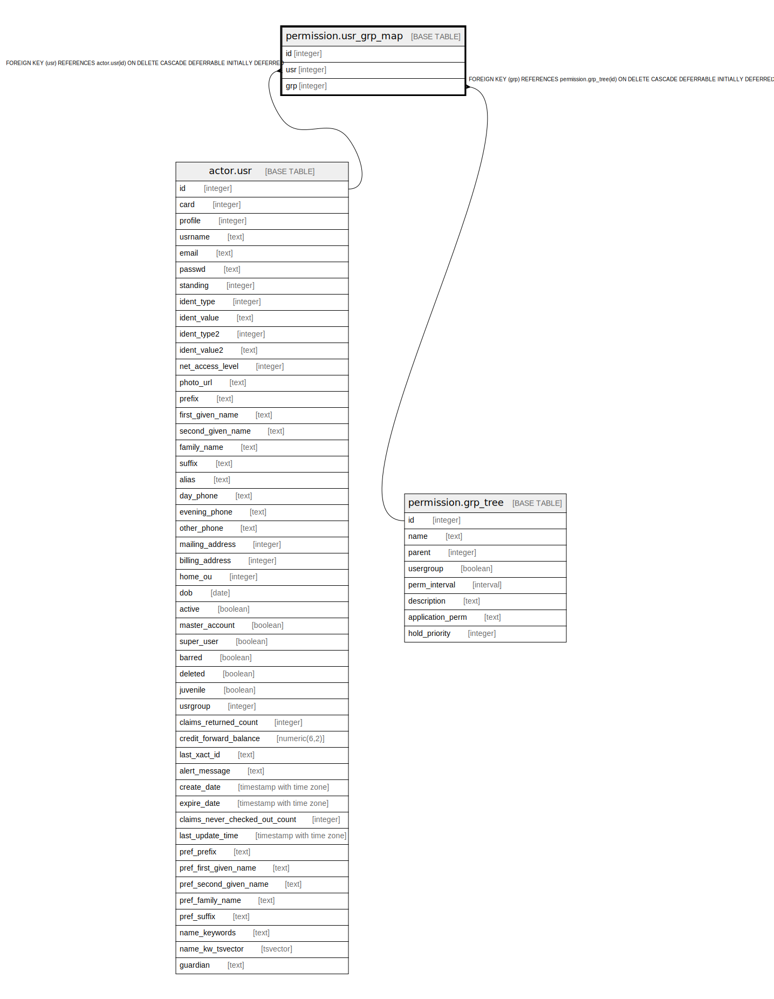

# permission.usr_grp_map

## Description

## Columns

| Name | Type | Default | Nullable | Children | Parents | Comment |
| ---- | ---- | ------- | -------- | -------- | ------- | ------- |
| id | integer | nextval('permission.usr_grp_map_id_seq'::regclass) | false |  |  |  |
| usr | integer |  | false |  | [actor.usr](actor.usr.md) |  |
| grp | integer |  | false |  | [permission.grp_tree](permission.grp_tree.md) |  |

## Constraints

| Name | Type | Definition |
| ---- | ---- | ---------- |
| usr_grp_map_usr_fkey | FOREIGN KEY | FOREIGN KEY (usr) REFERENCES actor.usr(id) ON DELETE CASCADE DEFERRABLE INITIALLY DEFERRED |
| usr_grp_map_grp_fkey | FOREIGN KEY | FOREIGN KEY (grp) REFERENCES permission.grp_tree(id) ON DELETE CASCADE DEFERRABLE INITIALLY DEFERRED |
| usr_grp_map_pkey | PRIMARY KEY | PRIMARY KEY (id) |
| usr_grp_once | UNIQUE | UNIQUE (usr, grp) |

## Indexes

| Name | Definition |
| ---- | ---------- |
| usr_grp_map_pkey | CREATE UNIQUE INDEX usr_grp_map_pkey ON permission.usr_grp_map USING btree (id) |
| usr_grp_once | CREATE UNIQUE INDEX usr_grp_once ON permission.usr_grp_map USING btree (usr, grp) |

## Relations

---

> Generated by [tbls](https://github.com/k1LoW/tbls)
