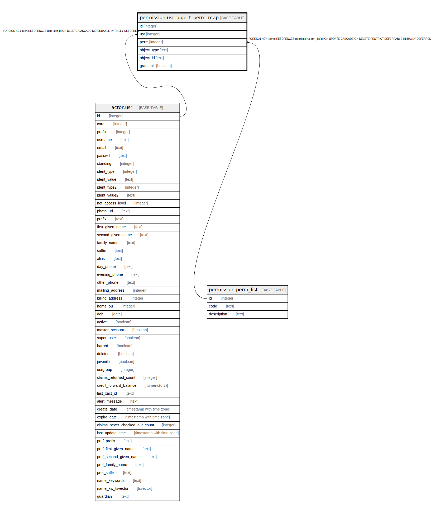

# permission.usr_object_perm_map

## Description

## Columns

| Name | Type | Default | Nullable | Children | Parents | Comment |
| ---- | ---- | ------- | -------- | -------- | ------- | ------- |
| id | integer | nextval('permission.usr_object_perm_map_id_seq'::regclass) | false |  |  |  |
| usr | integer |  | false |  | [actor.usr](actor.usr.md) |  |
| perm | integer |  | false |  | [permission.perm_list](permission.perm_list.md) |  |
| object_type | text |  | false |  |  |  |
| object_id | text |  | false |  |  |  |
| grantable | boolean | false | false |  |  |  |

## Constraints

| Name | Type | Definition |
| ---- | ---- | ---------- |
| usr_object_perm_map_usr_fkey | FOREIGN KEY | FOREIGN KEY (usr) REFERENCES actor.usr(id) ON DELETE CASCADE DEFERRABLE INITIALLY DEFERRED |
| usr_object_perm_map_perm_fkey | FOREIGN KEY | FOREIGN KEY (perm) REFERENCES permission.perm_list(id) ON UPDATE CASCADE ON DELETE RESTRICT DEFERRABLE INITIALLY DEFERRED |
| perm_usr_obj_once | UNIQUE | UNIQUE (usr, perm, object_type, object_id) |
| usr_object_perm_map_pkey | PRIMARY KEY | PRIMARY KEY (id) |

## Indexes

| Name | Definition |
| ---- | ---------- |
| perm_usr_obj_once | CREATE UNIQUE INDEX perm_usr_obj_once ON permission.usr_object_perm_map USING btree (usr, perm, object_type, object_id) |
| usr_object_perm_map_pkey | CREATE UNIQUE INDEX usr_object_perm_map_pkey ON permission.usr_object_perm_map USING btree (id) |
| uopm_usr_idx | CREATE INDEX uopm_usr_idx ON permission.usr_object_perm_map USING btree (usr) |

## Relations

---

> Generated by [tbls](https://github.com/k1LoW/tbls)
