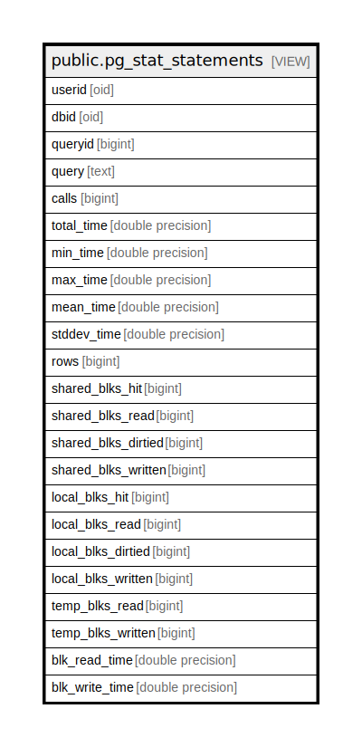

# public.pg_stat_statements

## Description

<details>
<summary><strong>Table Definition</strong></summary>

```sql
CREATE VIEW pg_stat_statements AS (
 SELECT pg_stat_statements.userid,
    pg_stat_statements.dbid,
    pg_stat_statements.queryid,
    pg_stat_statements.query,
    pg_stat_statements.calls,
    pg_stat_statements.total_time,
    pg_stat_statements.min_time,
    pg_stat_statements.max_time,
    pg_stat_statements.mean_time,
    pg_stat_statements.stddev_time,
    pg_stat_statements.rows,
    pg_stat_statements.shared_blks_hit,
    pg_stat_statements.shared_blks_read,
    pg_stat_statements.shared_blks_dirtied,
    pg_stat_statements.shared_blks_written,
    pg_stat_statements.local_blks_hit,
    pg_stat_statements.local_blks_read,
    pg_stat_statements.local_blks_dirtied,
    pg_stat_statements.local_blks_written,
    pg_stat_statements.temp_blks_read,
    pg_stat_statements.temp_blks_written,
    pg_stat_statements.blk_read_time,
    pg_stat_statements.blk_write_time
   FROM pg_stat_statements(true) pg_stat_statements(userid, dbid, queryid, query, calls, total_time, min_time, max_time, mean_time, stddev_time, rows, shared_blks_hit, shared_blks_read, shared_blks_dirtied, shared_blks_written, local_blks_hit, local_blks_read, local_blks_dirtied, local_blks_written, temp_blks_read, temp_blks_written, blk_read_time, blk_write_time)
)
```

</details>

## Columns

| Name | Type | Default | Nullable | Children | Parents | Comment |
| ---- | ---- | ------- | -------- | -------- | ------- | ------- |
| userid | oid |  | true |  |  |  |
| dbid | oid |  | true |  |  |  |
| queryid | bigint |  | true |  |  |  |
| query | text |  | true |  |  |  |
| calls | bigint |  | true |  |  |  |
| total_time | double precision |  | true |  |  |  |
| min_time | double precision |  | true |  |  |  |
| max_time | double precision |  | true |  |  |  |
| mean_time | double precision |  | true |  |  |  |
| stddev_time | double precision |  | true |  |  |  |
| rows | bigint |  | true |  |  |  |
| shared_blks_hit | bigint |  | true |  |  |  |
| shared_blks_read | bigint |  | true |  |  |  |
| shared_blks_dirtied | bigint |  | true |  |  |  |
| shared_blks_written | bigint |  | true |  |  |  |
| local_blks_hit | bigint |  | true |  |  |  |
| local_blks_read | bigint |  | true |  |  |  |
| local_blks_dirtied | bigint |  | true |  |  |  |
| local_blks_written | bigint |  | true |  |  |  |
| temp_blks_read | bigint |  | true |  |  |  |
| temp_blks_written | bigint |  | true |  |  |  |
| blk_read_time | double precision |  | true |  |  |  |
| blk_write_time | double precision |  | true |  |  |  |

## Referenced Tables

| Name | Columns | Comment | Type |
| ---- | ------- | ------- | ---- |
| [pg_stat_statements](pg_stat_statements.md) | 0 |  |  |

## Relations



---

> Generated by [tbls](https://github.com/k1LoW/tbls)
