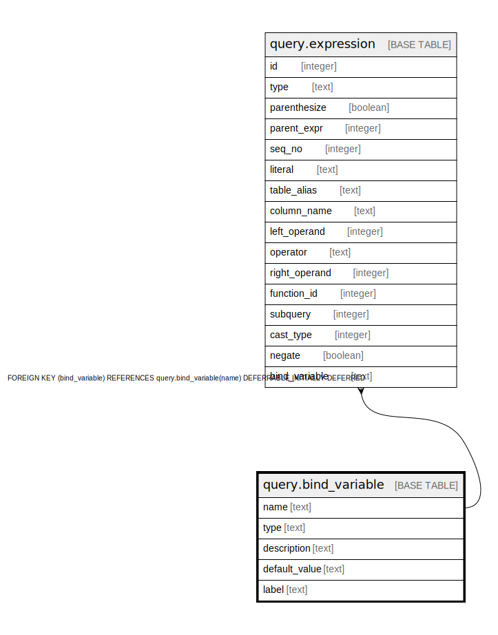

# query.bind_variable

## Description

## Columns

| Name | Type | Default | Nullable | Children | Parents | Comment |
| ---- | ---- | ------- | -------- | -------- | ------- | ------- |
| name | text |  | false | [query.expression](query.expression.md) |  |  |
| type | text |  | false |  |  |  |
| description | text |  | false |  |  |  |
| default_value | text |  | true |  |  |  |
| label | text |  | false |  |  |  |

## Constraints

| Name | Type | Definition |
| ---- | ---- | ---------- |
| bind_variable_type | CHECK | CHECK ((type = ANY (ARRAY['string'::text, 'number'::text, 'string_list'::text, 'number_list'::text]))) |
| bind_variable_pkey | PRIMARY KEY | PRIMARY KEY (name) |

## Indexes

| Name | Definition |
| ---- | ---------- |
| bind_variable_pkey | CREATE UNIQUE INDEX bind_variable_pkey ON query.bind_variable USING btree (name) |

## Relations

---

> Generated by [tbls](https://github.com/k1LoW/tbls)
