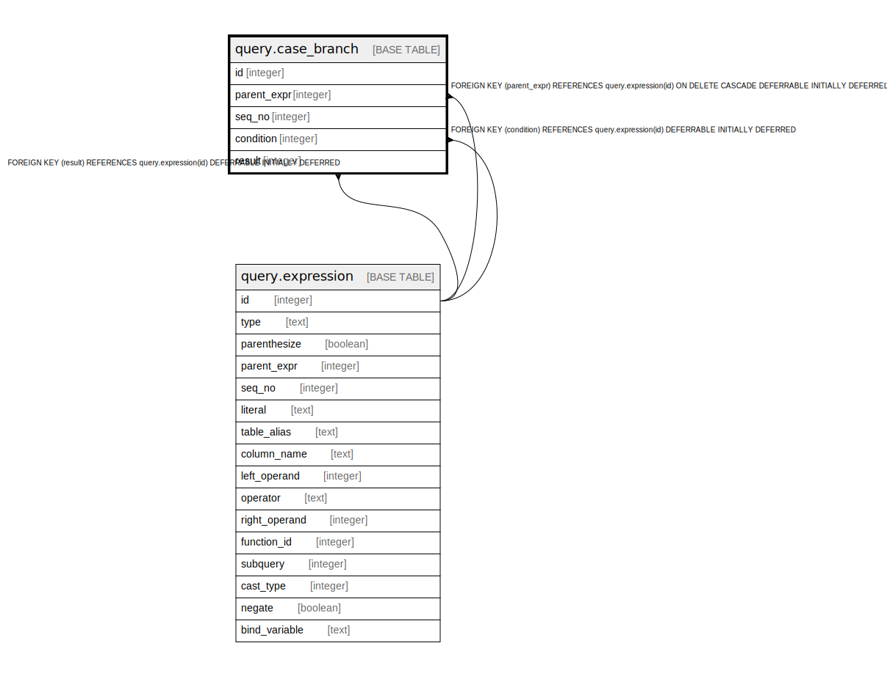

# query.case_branch

## Description

## Columns

| Name | Type | Default | Nullable | Children | Parents | Comment |
| ---- | ---- | ------- | -------- | -------- | ------- | ------- |
| id | integer | nextval('query.case_branch_id_seq'::regclass) | false |  |  |  |
| parent_expr | integer |  | false |  | [query.expression](query.expression.md) |  |
| seq_no | integer |  | false |  |  |  |
| condition | integer |  | true |  | [query.expression](query.expression.md) |  |
| result | integer |  | false |  | [query.expression](query.expression.md) |  |

## Constraints

| Name | Type | Definition |
| ---- | ---- | ---------- |
| case_branch_parent_seq | UNIQUE | UNIQUE (parent_expr, seq_no) |
| case_branch_pkey | PRIMARY KEY | PRIMARY KEY (id) |
| case_branch_condition_fkey | FOREIGN KEY | FOREIGN KEY (condition) REFERENCES query.expression(id) DEFERRABLE INITIALLY DEFERRED |
| case_branch_parent_expr_fkey | FOREIGN KEY | FOREIGN KEY (parent_expr) REFERENCES query.expression(id) ON DELETE CASCADE DEFERRABLE INITIALLY DEFERRED |
| case_branch_result_fkey | FOREIGN KEY | FOREIGN KEY (result) REFERENCES query.expression(id) DEFERRABLE INITIALLY DEFERRED |

## Indexes

| Name | Definition |
| ---- | ---------- |
| case_branch_parent_seq | CREATE UNIQUE INDEX case_branch_parent_seq ON query.case_branch USING btree (parent_expr, seq_no) |
| case_branch_pkey | CREATE UNIQUE INDEX case_branch_pkey ON query.case_branch USING btree (id) |

## Relations

---

> Generated by [tbls](https://github.com/k1LoW/tbls)
