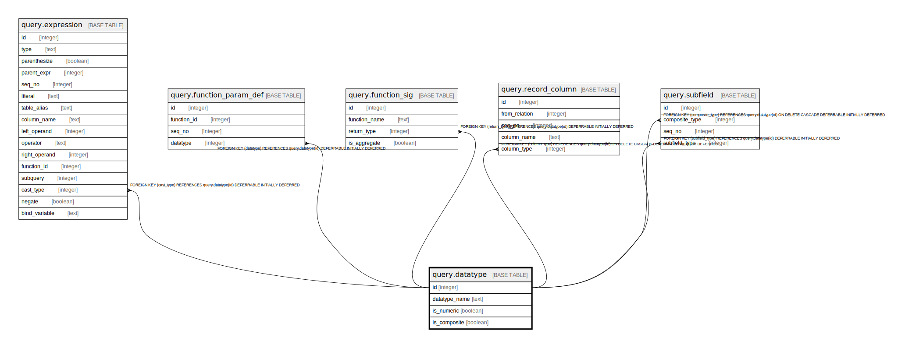

# query.datatype

## Description

## Columns

| Name | Type | Default | Nullable | Children | Parents | Comment |
| ---- | ---- | ------- | -------- | -------- | ------- | ------- |
| id | integer | nextval('query.datatype_id_seq'::regclass) | false | [query.expression](query.expression.md) [query.function_param_def](query.function_param_def.md) [query.function_sig](query.function_sig.md) [query.record_column](query.record_column.md) [query.subfield](query.subfield.md) |  |  |
| datatype_name | text |  | false |  |  |  |
| is_numeric | boolean | false | false |  |  |  |
| is_composite | boolean | false | false |  |  |  |

## Constraints

| Name | Type | Definition |
| ---- | ---- | ---------- |
| qdt_comp_not_num | CHECK | CHECK (((is_numeric IS FALSE) OR (is_composite IS FALSE))) |
| datatype_datatype_name_key | UNIQUE | UNIQUE (datatype_name) |
| datatype_pkey | PRIMARY KEY | PRIMARY KEY (id) |

## Indexes

| Name | Definition |
| ---- | ---------- |
| datatype_datatype_name_key | CREATE UNIQUE INDEX datatype_datatype_name_key ON query.datatype USING btree (datatype_name) |
| datatype_pkey | CREATE UNIQUE INDEX datatype_pkey ON query.datatype USING btree (id) |

## Relations

---

> Generated by [tbls](https://github.com/k1LoW/tbls)
