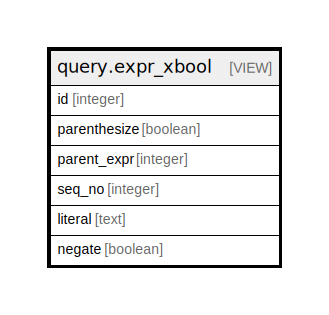

# query.expr_xbool

## Description

<details>
<summary><strong>Table Definition</strong></summary>

```sql
CREATE VIEW expr_xbool AS (
 SELECT expression.id,
    expression.parenthesize,
    expression.parent_expr,
    expression.seq_no,
    expression.literal,
    expression.negate
   FROM query.expression
  WHERE (expression.type = 'xbool'::text)
)
```

</details>

## Columns

| Name | Type | Default | Nullable | Children | Parents | Comment |
| ---- | ---- | ------- | -------- | -------- | ------- | ------- |
| id | integer |  | true |  |  |  |
| parenthesize | boolean |  | true |  |  |  |
| parent_expr | integer |  | true |  |  |  |
| seq_no | integer |  | true |  |  |  |
| literal | text |  | true |  |  |  |
| negate | boolean |  | true |  |  |  |

## Referenced Tables

| Name | Columns | Comment | Type |
| ---- | ------- | ------- | ---- |
| [query.expression](query.expression.md) | 16 |  | BASE TABLE |

## Relations



---

> Generated by [tbls](https://github.com/k1LoW/tbls)
