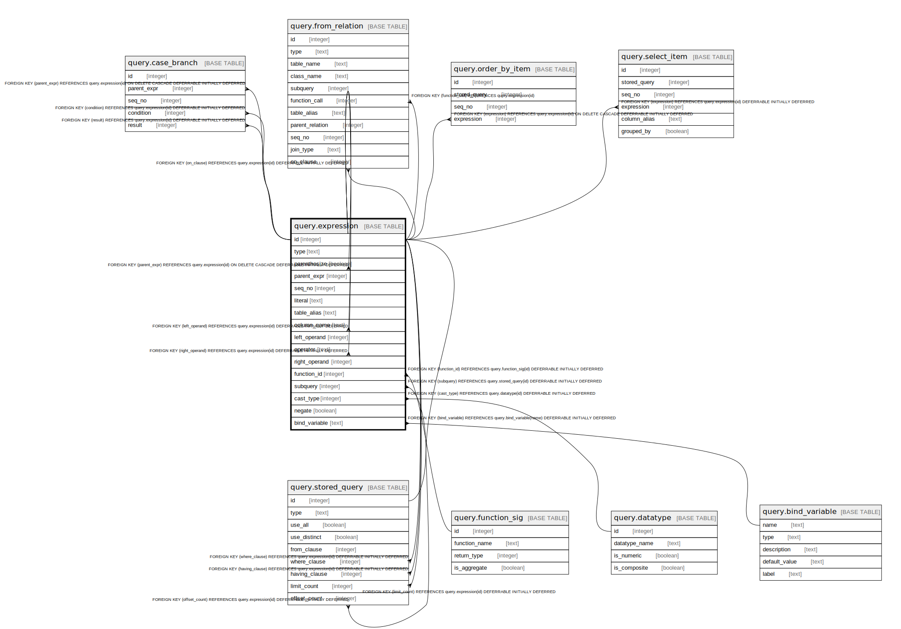

# query.expression

## Description

## Columns

| Name | Type | Default | Nullable | Children | Parents | Comment |
| ---- | ---- | ------- | -------- | -------- | ------- | ------- |
| id | integer | nextval('query.expression_id_seq'::regclass) | false | [query.case_branch](query.case_branch.md) [query.expression](query.expression.md) [query.from_relation](query.from_relation.md) [query.order_by_item](query.order_by_item.md) [query.select_item](query.select_item.md) [query.stored_query](query.stored_query.md) |  |  |
| type | text |  | false |  |  |  |
| parenthesize | boolean | false | false |  |  |  |
| parent_expr | integer |  | true |  | [query.expression](query.expression.md) |  |
| seq_no | integer | 1 | false |  |  |  |
| literal | text |  | true |  |  |  |
| table_alias | text |  | true |  |  |  |
| column_name | text |  | true |  |  |  |
| left_operand | integer |  | true |  | [query.expression](query.expression.md) |  |
| operator | text |  | true |  |  |  |
| right_operand | integer |  | true |  | [query.expression](query.expression.md) |  |
| function_id | integer |  | true |  | [query.function_sig](query.function_sig.md) |  |
| subquery | integer |  | true |  | [query.stored_query](query.stored_query.md) |  |
| cast_type | integer |  | true |  | [query.datatype](query.datatype.md) |  |
| negate | boolean | false | false |  |  |  |
| bind_variable | text |  | true |  | [query.bind_variable](query.bind_variable.md) |  |

## Constraints

| Name | Type | Definition |
| ---- | ---- | ---------- |
| expression_type | CHECK | CHECK ((type = ANY (ARRAY['xbet'::text, 'xbind'::text, 'xbool'::text, 'xcase'::text, 'xcast'::text, 'xcol'::text, 'xex'::text, 'xfunc'::text, 'xin'::text, 'xisnull'::text, 'xnull'::text, 'xnum'::text, 'xop'::text, 'xser'::text, 'xstr'::text, 'xsubq'::text]))) |
| expression_bind_variable_fkey | FOREIGN KEY | FOREIGN KEY (bind_variable) REFERENCES query.bind_variable(name) DEFERRABLE INITIALLY DEFERRED |
| expression_cast_type_fkey | FOREIGN KEY | FOREIGN KEY (cast_type) REFERENCES query.datatype(id) DEFERRABLE INITIALLY DEFERRED |
| expression_left_operand_fkey | FOREIGN KEY | FOREIGN KEY (left_operand) REFERENCES query.expression(id) DEFERRABLE INITIALLY DEFERRED |
| expression_parent_expr_fkey | FOREIGN KEY | FOREIGN KEY (parent_expr) REFERENCES query.expression(id) ON DELETE CASCADE DEFERRABLE INITIALLY DEFERRED |
| expression_pkey | PRIMARY KEY | PRIMARY KEY (id) |
| expression_right_operand_fkey | FOREIGN KEY | FOREIGN KEY (right_operand) REFERENCES query.expression(id) DEFERRABLE INITIALLY DEFERRED |
| expression_function_id_fkey | FOREIGN KEY | FOREIGN KEY (function_id) REFERENCES query.function_sig(id) DEFERRABLE INITIALLY DEFERRED |
| expression_subquery_fkey | FOREIGN KEY | FOREIGN KEY (subquery) REFERENCES query.stored_query(id) DEFERRABLE INITIALLY DEFERRED |

## Indexes

| Name | Definition |
| ---- | ---------- |
| expression_pkey | CREATE UNIQUE INDEX expression_pkey ON query.expression USING btree (id) |
| query_expr_parent_seq | CREATE UNIQUE INDEX query_expr_parent_seq ON query.expression USING btree (parent_expr, seq_no) WHERE (parent_expr IS NOT NULL) |

## Relations

---

> Generated by [tbls](https://github.com/k1LoW/tbls)
