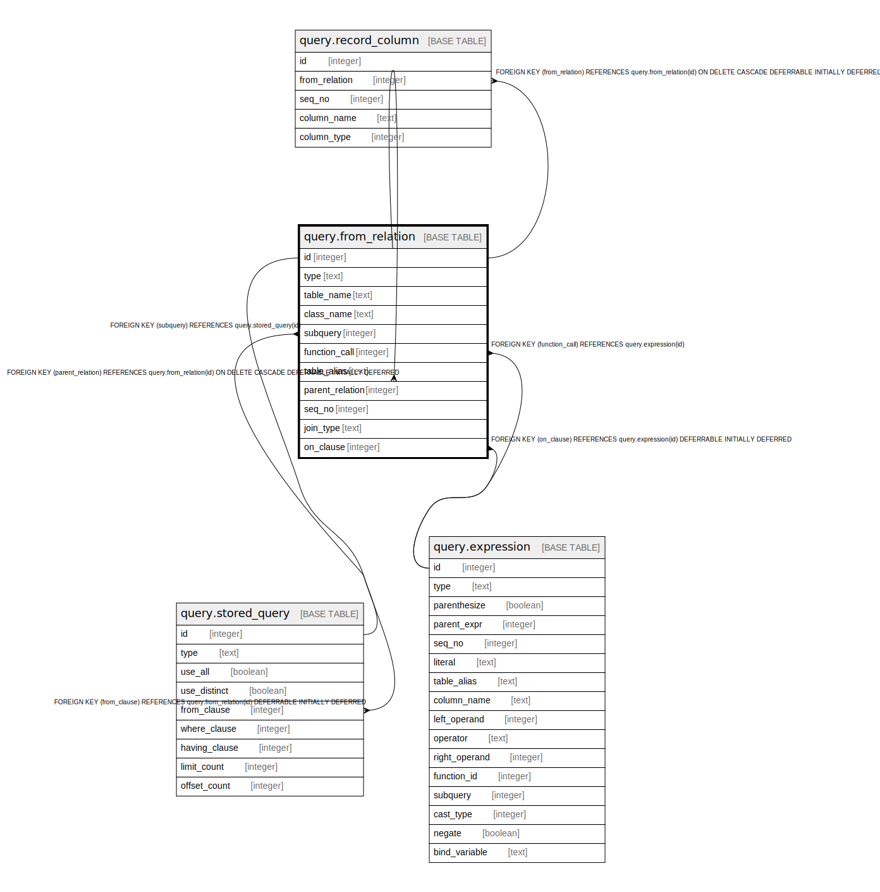

# query.from_relation

## Description

## Columns

| Name | Type | Default | Nullable | Children | Parents | Comment |
| ---- | ---- | ------- | -------- | -------- | ------- | ------- |
| id | integer | nextval('query.from_relation_id_seq'::regclass) | false | [query.from_relation](query.from_relation.md) [query.record_column](query.record_column.md) [query.stored_query](query.stored_query.md) |  |  |
| type | text |  | false |  |  |  |
| table_name | text |  | true |  |  |  |
| class_name | text |  | true |  |  |  |
| subquery | integer |  | true |  | [query.stored_query](query.stored_query.md) |  |
| function_call | integer |  | true |  | [query.expression](query.expression.md) |  |
| table_alias | text |  | true |  |  |  |
| parent_relation | integer |  | true |  | [query.from_relation](query.from_relation.md) |  |
| seq_no | integer | 1 | false |  |  |  |
| join_type | text |  | true |  |  |  |
| on_clause | integer |  | true |  | [query.expression](query.expression.md) |  |

## Constraints

| Name | Type | Definition |
| ---- | ---- | ---------- |
| good_join_type | CHECK | CHECK (((join_type IS NULL) OR (join_type = ANY (ARRAY['INNER'::text, 'LEFT'::text, 'RIGHT'::text, 'FULL'::text])))) |
| join_or_core | CHECK | CHECK ((((parent_relation IS NULL) AND (join_type IS NULL) AND (on_clause IS NULL)) OR ((parent_relation IS NOT NULL) AND (join_type IS NOT NULL) AND (on_clause IS NOT NULL)))) |
| relation_type | CHECK | CHECK ((type = ANY (ARRAY['RELATION'::text, 'SUBQUERY'::text, 'FUNCTION'::text]))) |
| from_relation_function_call_fkey | FOREIGN KEY | FOREIGN KEY (function_call) REFERENCES query.expression(id) |
| from_relation_on_clause_fkey | FOREIGN KEY | FOREIGN KEY (on_clause) REFERENCES query.expression(id) DEFERRABLE INITIALLY DEFERRED |
| from_relation_parent_relation_fkey | FOREIGN KEY | FOREIGN KEY (parent_relation) REFERENCES query.from_relation(id) ON DELETE CASCADE DEFERRABLE INITIALLY DEFERRED |
| from_relation_pkey | PRIMARY KEY | PRIMARY KEY (id) |
| from_relation_subquery_fkey | FOREIGN KEY | FOREIGN KEY (subquery) REFERENCES query.stored_query(id) |

## Indexes

| Name | Definition |
| ---- | ---------- |
| from_relation_pkey | CREATE UNIQUE INDEX from_relation_pkey ON query.from_relation USING btree (id) |
| from_parent_seq | CREATE UNIQUE INDEX from_parent_seq ON query.from_relation USING btree (parent_relation, seq_no) WHERE (parent_relation IS NOT NULL) |

## Relations

---

> Generated by [tbls](https://github.com/k1LoW/tbls)
