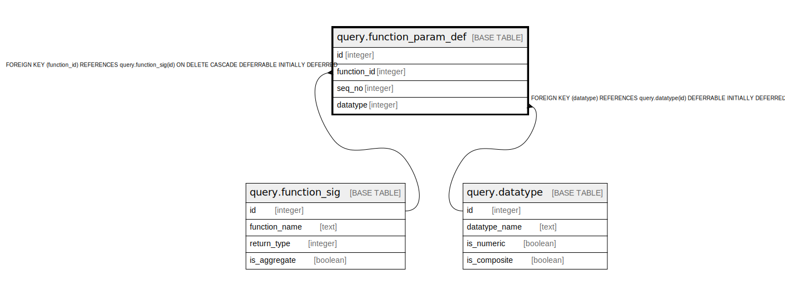

# query.function_param_def

## Description

## Columns

| Name | Type | Default | Nullable | Children | Parents | Comment |
| ---- | ---- | ------- | -------- | -------- | ------- | ------- |
| id | integer | nextval('query.function_param_def_id_seq'::regclass) | false |  |  |  |
| function_id | integer |  | false |  | [query.function_sig](query.function_sig.md) |  |
| seq_no | integer |  | false |  |  |  |
| datatype | integer |  | false |  | [query.datatype](query.datatype.md) |  |

## Constraints

| Name | Type | Definition |
| ---- | ---- | ---------- |
| qfpd_pos_seq_no | CHECK | CHECK ((seq_no > 0)) |
| function_param_def_datatype_fkey | FOREIGN KEY | FOREIGN KEY (datatype) REFERENCES query.datatype(id) DEFERRABLE INITIALLY DEFERRED |
| function_param_def_pkey | PRIMARY KEY | PRIMARY KEY (id) |
| function_param_def_function_id_fkey | FOREIGN KEY | FOREIGN KEY (function_id) REFERENCES query.function_sig(id) ON DELETE CASCADE DEFERRABLE INITIALLY DEFERRED |
| qfpd_function_param_seq | UNIQUE | UNIQUE (function_id, seq_no) |

## Indexes

| Name | Definition |
| ---- | ---------- |
| function_param_def_pkey | CREATE UNIQUE INDEX function_param_def_pkey ON query.function_param_def USING btree (id) |
| qfpd_function_param_seq | CREATE UNIQUE INDEX qfpd_function_param_seq ON query.function_param_def USING btree (function_id, seq_no) |

## Relations

---

> Generated by [tbls](https://github.com/k1LoW/tbls)
