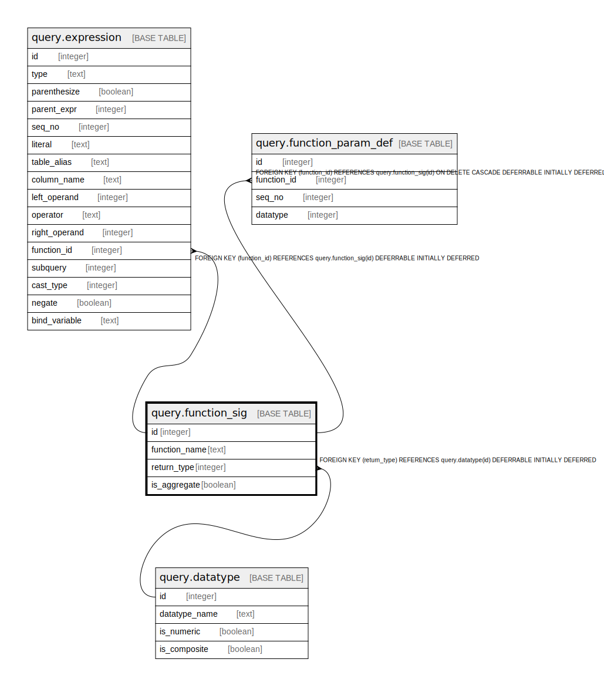

# query.function_sig

## Description

## Columns

| Name | Type | Default | Nullable | Children | Parents | Comment |
| ---- | ---- | ------- | -------- | -------- | ------- | ------- |
| id | integer | nextval('query.function_sig_id_seq'::regclass) | false | [query.expression](query.expression.md) [query.function_param_def](query.function_param_def.md) |  |  |
| function_name | text |  | false |  |  |  |
| return_type | integer |  | true |  | [query.datatype](query.datatype.md) |  |
| is_aggregate | boolean | false | false |  |  |  |

## Constraints

| Name | Type | Definition |
| ---- | ---- | ---------- |
| qfd_rtn_or_aggr | CHECK | CHECK (((return_type IS NULL) OR (is_aggregate = false))) |
| function_sig_return_type_fkey | FOREIGN KEY | FOREIGN KEY (return_type) REFERENCES query.datatype(id) DEFERRABLE INITIALLY DEFERRED |
| function_sig_pkey | PRIMARY KEY | PRIMARY KEY (id) |

## Indexes

| Name | Definition |
| ---- | ---------- |
| function_sig_pkey | CREATE UNIQUE INDEX function_sig_pkey ON query.function_sig USING btree (id) |
| query_function_sig_name_idx | CREATE INDEX query_function_sig_name_idx ON query.function_sig USING btree (function_name) |

## Relations

---

> Generated by [tbls](https://github.com/k1LoW/tbls)
