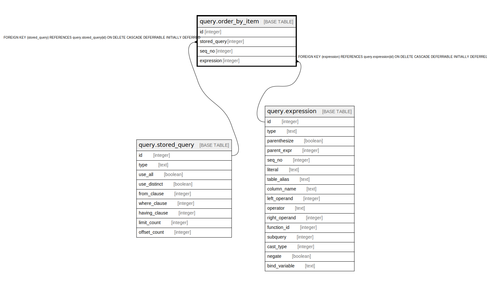

# query.order_by_item

## Description

## Columns

| Name | Type | Default | Nullable | Children | Parents | Comment |
| ---- | ---- | ------- | -------- | -------- | ------- | ------- |
| id | integer | nextval('query.order_by_item_id_seq'::regclass) | false |  |  |  |
| stored_query | integer |  | false |  | [query.stored_query](query.stored_query.md) |  |
| seq_no | integer |  | false |  |  |  |
| expression | integer |  | false |  | [query.expression](query.expression.md) |  |

## Constraints

| Name | Type | Definition |
| ---- | ---- | ---------- |
| order_by_item_expression_fkey | FOREIGN KEY | FOREIGN KEY (expression) REFERENCES query.expression(id) ON DELETE CASCADE DEFERRABLE INITIALLY DEFERRED |
| order_by_item_pkey | PRIMARY KEY | PRIMARY KEY (id) |
| order_by_sequence | UNIQUE | UNIQUE (stored_query, seq_no) |
| order_by_item_stored_query_fkey | FOREIGN KEY | FOREIGN KEY (stored_query) REFERENCES query.stored_query(id) ON DELETE CASCADE DEFERRABLE INITIALLY DEFERRED |

## Indexes

| Name | Definition |
| ---- | ---------- |
| order_by_item_pkey | CREATE UNIQUE INDEX order_by_item_pkey ON query.order_by_item USING btree (id) |
| order_by_sequence | CREATE UNIQUE INDEX order_by_sequence ON query.order_by_item USING btree (stored_query, seq_no) |

## Relations

---

> Generated by [tbls](https://github.com/k1LoW/tbls)
