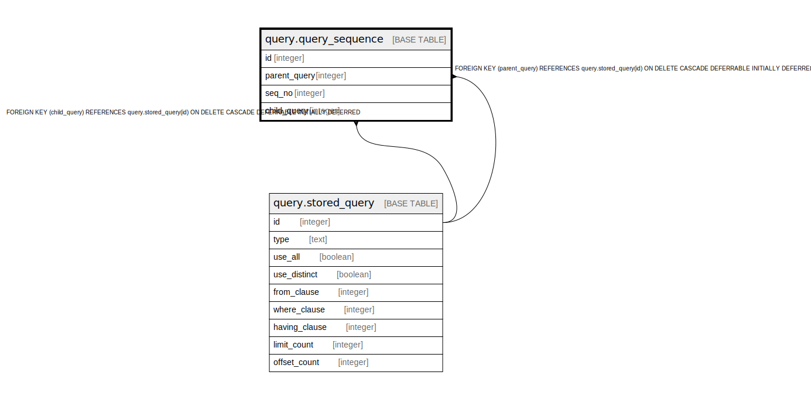

# query.query_sequence

## Description

## Columns

| Name | Type | Default | Nullable | Children | Parents | Comment |
| ---- | ---- | ------- | -------- | -------- | ------- | ------- |
| id | integer | nextval('query.query_sequence_id_seq'::regclass) | false |  |  |  |
| parent_query | integer |  | false |  | [query.stored_query](query.stored_query.md) |  |
| seq_no | integer |  | false |  |  |  |
| child_query | integer |  | false |  | [query.stored_query](query.stored_query.md) |  |

## Constraints

| Name | Type | Definition |
| ---- | ---- | ---------- |
| query_query_seq | UNIQUE | UNIQUE (parent_query, seq_no) |
| query_sequence_pkey | PRIMARY KEY | PRIMARY KEY (id) |
| query_sequence_child_query_fkey | FOREIGN KEY | FOREIGN KEY (child_query) REFERENCES query.stored_query(id) ON DELETE CASCADE DEFERRABLE INITIALLY DEFERRED |
| query_sequence_parent_query_fkey | FOREIGN KEY | FOREIGN KEY (parent_query) REFERENCES query.stored_query(id) ON DELETE CASCADE DEFERRABLE INITIALLY DEFERRED |

## Indexes

| Name | Definition |
| ---- | ---------- |
| query_query_seq | CREATE UNIQUE INDEX query_query_seq ON query.query_sequence USING btree (parent_query, seq_no) |
| query_sequence_pkey | CREATE UNIQUE INDEX query_sequence_pkey ON query.query_sequence USING btree (id) |

## Relations

---

> Generated by [tbls](https://github.com/k1LoW/tbls)
