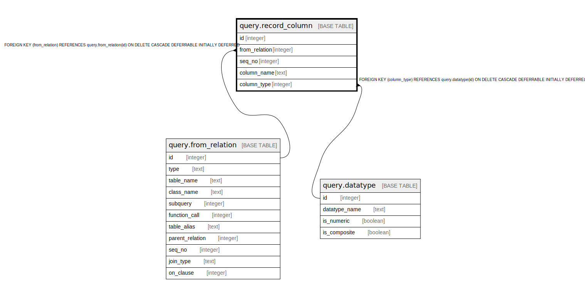

# query.record_column

## Description

## Columns

| Name | Type | Default | Nullable | Children | Parents | Comment |
| ---- | ---- | ------- | -------- | -------- | ------- | ------- |
| id | integer | nextval('query.record_column_id_seq'::regclass) | false |  |  |  |
| from_relation | integer |  | false |  | [query.from_relation](query.from_relation.md) |  |
| seq_no | integer |  | false |  |  |  |
| column_name | text |  | false |  |  |  |
| column_type | integer |  | false |  | [query.datatype](query.datatype.md) |  |

## Constraints

| Name | Type | Definition |
| ---- | ---- | ---------- |
| column_sequence | UNIQUE | UNIQUE (from_relation, seq_no) |
| record_column_column_type_fkey | FOREIGN KEY | FOREIGN KEY (column_type) REFERENCES query.datatype(id) ON DELETE CASCADE DEFERRABLE INITIALLY DEFERRED |
| record_column_from_relation_fkey | FOREIGN KEY | FOREIGN KEY (from_relation) REFERENCES query.from_relation(id) ON DELETE CASCADE DEFERRABLE INITIALLY DEFERRED |
| record_column_pkey | PRIMARY KEY | PRIMARY KEY (id) |

## Indexes

| Name | Definition |
| ---- | ---------- |
| column_sequence | CREATE UNIQUE INDEX column_sequence ON query.record_column USING btree (from_relation, seq_no) |
| record_column_pkey | CREATE UNIQUE INDEX record_column_pkey ON query.record_column USING btree (id) |

## Relations

---

> Generated by [tbls](https://github.com/k1LoW/tbls)
