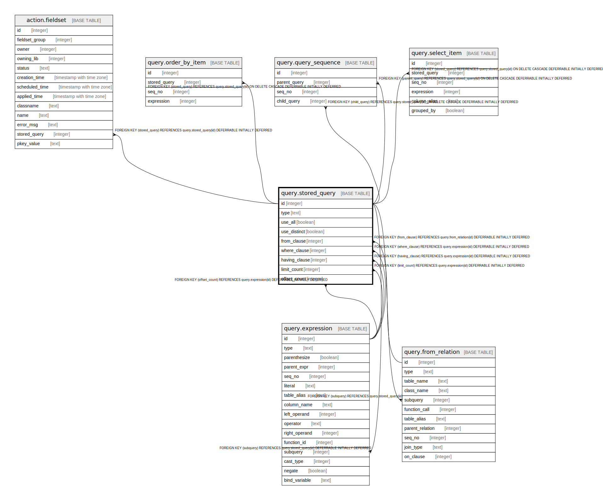

# query.stored_query

## Description

## Columns

| Name | Type | Default | Nullable | Children | Parents | Comment |
| ---- | ---- | ------- | -------- | -------- | ------- | ------- |
| id | integer | nextval('query.stored_query_id_seq'::regclass) | false | [action.fieldset](action.fieldset.md) [query.expression](query.expression.md) [query.from_relation](query.from_relation.md) [query.order_by_item](query.order_by_item.md) [query.query_sequence](query.query_sequence.md) [query.select_item](query.select_item.md) |  |  |
| type | text |  | false |  |  |  |
| use_all | boolean | false | false |  |  |  |
| use_distinct | boolean | false | false |  |  |  |
| from_clause | integer |  | true |  | [query.from_relation](query.from_relation.md) |  |
| where_clause | integer |  | true |  | [query.expression](query.expression.md) |  |
| having_clause | integer |  | true |  | [query.expression](query.expression.md) |  |
| limit_count | integer |  | true |  | [query.expression](query.expression.md) |  |
| offset_count | integer |  | true |  | [query.expression](query.expression.md) |  |

## Constraints

| Name | Type | Definition |
| ---- | ---- | ---------- |
| query_type | CHECK | CHECK ((type = ANY (ARRAY['SELECT'::text, 'UNION'::text, 'INTERSECT'::text, 'EXCEPT'::text]))) |
| stored_query_having_clause_fkey | FOREIGN KEY | FOREIGN KEY (having_clause) REFERENCES query.expression(id) DEFERRABLE INITIALLY DEFERRED |
| stored_query_limit_count_fkey | FOREIGN KEY | FOREIGN KEY (limit_count) REFERENCES query.expression(id) DEFERRABLE INITIALLY DEFERRED |
| stored_query_offset_count_fkey | FOREIGN KEY | FOREIGN KEY (offset_count) REFERENCES query.expression(id) DEFERRABLE INITIALLY DEFERRED |
| stored_query_where_clause_fkey | FOREIGN KEY | FOREIGN KEY (where_clause) REFERENCES query.expression(id) DEFERRABLE INITIALLY DEFERRED |
| stored_query_from_clause_fkey | FOREIGN KEY | FOREIGN KEY (from_clause) REFERENCES query.from_relation(id) DEFERRABLE INITIALLY DEFERRED |
| stored_query_pkey | PRIMARY KEY | PRIMARY KEY (id) |

## Indexes

| Name | Definition |
| ---- | ---------- |
| stored_query_pkey | CREATE UNIQUE INDEX stored_query_pkey ON query.stored_query USING btree (id) |

## Relations

---

> Generated by [tbls](https://github.com/k1LoW/tbls)
