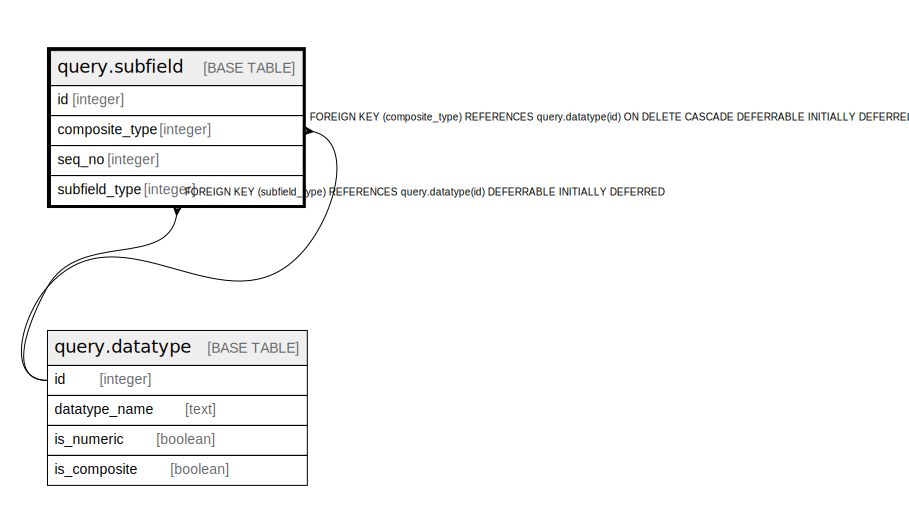

# query.subfield

## Description

## Columns

| Name | Type | Default | Nullable | Children | Parents | Comment |
| ---- | ---- | ------- | -------- | -------- | ------- | ------- |
| id | integer | nextval('query.subfield_id_seq'::regclass) | false |  |  |  |
| composite_type | integer |  | false |  | [query.datatype](query.datatype.md) |  |
| seq_no | integer |  | false |  |  |  |
| subfield_type | integer |  | false |  | [query.datatype](query.datatype.md) |  |

## Constraints

| Name | Type | Definition |
| ---- | ---- | ---------- |
| qsf_pos_seq_no | CHECK | CHECK ((seq_no > 0)) |
| subfield_composite_type_fkey | FOREIGN KEY | FOREIGN KEY (composite_type) REFERENCES query.datatype(id) ON DELETE CASCADE DEFERRABLE INITIALLY DEFERRED |
| subfield_subfield_type_fkey | FOREIGN KEY | FOREIGN KEY (subfield_type) REFERENCES query.datatype(id) DEFERRABLE INITIALLY DEFERRED |
| qsf_datatype_seq_no | UNIQUE | UNIQUE (composite_type, seq_no) |
| subfield_pkey | PRIMARY KEY | PRIMARY KEY (id) |

## Indexes

| Name | Definition |
| ---- | ---------- |
| qsf_datatype_seq_no | CREATE UNIQUE INDEX qsf_datatype_seq_no ON query.subfield USING btree (composite_type, seq_no) |
| subfield_pkey | CREATE UNIQUE INDEX subfield_pkey ON query.subfield USING btree (id) |

## Relations

---

> Generated by [tbls](https://github.com/k1LoW/tbls)
