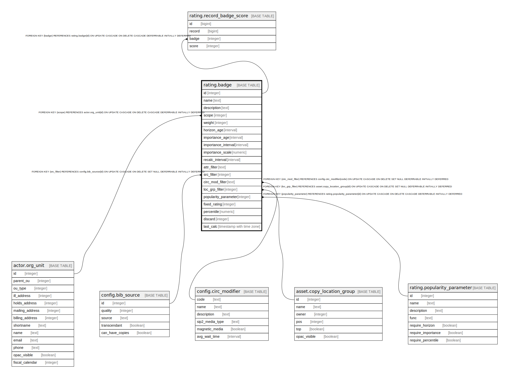

# rating.badge

## Description

## Columns

| Name | Type | Default | Nullable | Children | Parents | Comment |
| ---- | ---- | ------- | -------- | -------- | ------- | ------- |
| id | integer | nextval('rating.badge_id_seq'::regclass) | false | [rating.record_badge_score](rating.record_badge_score.md) |  |  |
| name | text |  | false |  |  |  |
| description | text |  | true |  |  |  |
| scope | integer |  | false |  | [actor.org_unit](actor.org_unit.md) |  |
| weight | integer | 1 | false |  |  |  |
| horizon_age | interval |  | true |  |  |  |
| importance_age | interval |  | true |  |  |  |
| importance_interval | interval | '1 day'::interval | false |  |  |  |
| importance_scale | numeric |  | true |  |  |  |
| recalc_interval | interval | '1 mon'::interval | false |  |  |  |
| attr_filter | text |  | true |  |  |  |
| src_filter | integer |  | true |  | [config.bib_source](config.bib_source.md) |  |
| circ_mod_filter | text |  | true |  | [config.circ_modifier](config.circ_modifier.md) |  |
| loc_grp_filter | integer |  | true |  | [asset.copy_location_group](asset.copy_location_group.md) |  |
| popularity_parameter | integer |  | false |  | [rating.popularity_parameter](rating.popularity_parameter.md) |  |
| fixed_rating | integer |  | true |  |  |  |
| percentile | numeric |  | true |  |  |  |
| discard | integer | 0 | false |  |  |  |
| last_calc | timestamp with time zone |  | true |  |  |  |

## Constraints

| Name | Type | Definition |
| ---- | ---- | ---------- |
| badge_fixed_rating_check | CHECK | CHECK (((fixed_rating IS NULL) OR ((fixed_rating >= '-5'::integer) AND (fixed_rating <= 5)))) |
| badge_importance_scale_check | CHECK | CHECK (((importance_scale IS NULL) OR (importance_scale > 0.0))) |
| badge_percentile_check | CHECK | CHECK (((percentile IS NULL) OR ((percentile >= 50.0) AND (percentile < 100.0)))) |
| badge_scope_fkey | FOREIGN KEY | FOREIGN KEY (scope) REFERENCES actor.org_unit(id) ON UPDATE CASCADE ON DELETE CASCADE DEFERRABLE INITIALLY DEFERRED |
| badge_loc_grp_filter_fkey | FOREIGN KEY | FOREIGN KEY (loc_grp_filter) REFERENCES asset.copy_location_group(id) ON UPDATE CASCADE ON DELETE SET NULL DEFERRABLE INITIALLY DEFERRED |
| badge_src_filter_fkey | FOREIGN KEY | FOREIGN KEY (src_filter) REFERENCES config.bib_source(id) ON UPDATE CASCADE ON DELETE SET NULL DEFERRABLE INITIALLY DEFERRED |
| badge_circ_mod_filter_fkey | FOREIGN KEY | FOREIGN KEY (circ_mod_filter) REFERENCES config.circ_modifier(code) ON UPDATE CASCADE ON DELETE SET NULL DEFERRABLE INITIALLY DEFERRED |
| badge_pkey | PRIMARY KEY | PRIMARY KEY (id) |
| badge_popularity_parameter_fkey | FOREIGN KEY | FOREIGN KEY (popularity_parameter) REFERENCES rating.popularity_parameter(id) ON UPDATE CASCADE ON DELETE CASCADE DEFERRABLE INITIALLY DEFERRED |
| unique_name_scope | UNIQUE | UNIQUE (name, scope) |

## Indexes

| Name | Definition |
| ---- | ---------- |
| badge_pkey | CREATE UNIQUE INDEX badge_pkey ON rating.badge USING btree (id) |
| unique_name_scope | CREATE UNIQUE INDEX unique_name_scope ON rating.badge USING btree (name, scope) |

## Relations

---

> Generated by [tbls](https://github.com/k1LoW/tbls)
