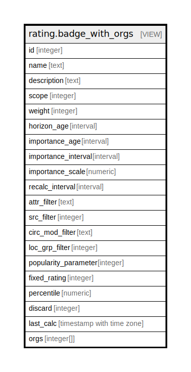

# rating.badge_with_orgs

## Description

<details>
<summary><strong>Table Definition</strong></summary>

```sql
CREATE VIEW badge_with_orgs AS (
 WITH org_scope AS (
         SELECT x.id,
            array_agg(x.tree) AS orgs
           FROM ( SELECT org_unit.id,
                    (actor.org_unit_descendants(org_unit.id)).id AS tree
                   FROM actor.org_unit) x
          GROUP BY x.id
        )
 SELECT b.id,
    b.name,
    b.description,
    b.scope,
    b.weight,
    b.horizon_age,
    b.importance_age,
    b.importance_interval,
    b.importance_scale,
    b.recalc_interval,
    b.attr_filter,
    b.src_filter,
    b.circ_mod_filter,
    b.loc_grp_filter,
    b.popularity_parameter,
    b.fixed_rating,
    b.percentile,
    b.discard,
    b.last_calc,
    s.orgs
   FROM (rating.badge b
     JOIN org_scope s ON ((b.scope = s.id)))
)
```

</details>

## Columns

| Name | Type | Default | Nullable | Children | Parents | Comment |
| ---- | ---- | ------- | -------- | -------- | ------- | ------- |
| id | integer |  | true |  |  |  |
| name | text |  | true |  |  |  |
| description | text |  | true |  |  |  |
| scope | integer |  | true |  |  |  |
| weight | integer |  | true |  |  |  |
| horizon_age | interval |  | true |  |  |  |
| importance_age | interval |  | true |  |  |  |
| importance_interval | interval |  | true |  |  |  |
| importance_scale | numeric |  | true |  |  |  |
| recalc_interval | interval |  | true |  |  |  |
| attr_filter | text |  | true |  |  |  |
| src_filter | integer |  | true |  |  |  |
| circ_mod_filter | text |  | true |  |  |  |
| loc_grp_filter | integer |  | true |  |  |  |
| popularity_parameter | integer |  | true |  |  |  |
| fixed_rating | integer |  | true |  |  |  |
| percentile | numeric |  | true |  |  |  |
| discard | integer |  | true |  |  |  |
| last_calc | timestamp with time zone |  | true |  |  |  |
| orgs | integer[] |  | true |  |  |  |

## Referenced Tables

| Name | Columns | Comment | Type |
| ---- | ------- | ------- | ---- |
| [actor.org_unit](actor.org_unit.md) | 13 |  | BASE TABLE |
| [rating.badge](rating.badge.md) | 19 |  | BASE TABLE |

## Relations



---

> Generated by [tbls](https://github.com/k1LoW/tbls)
