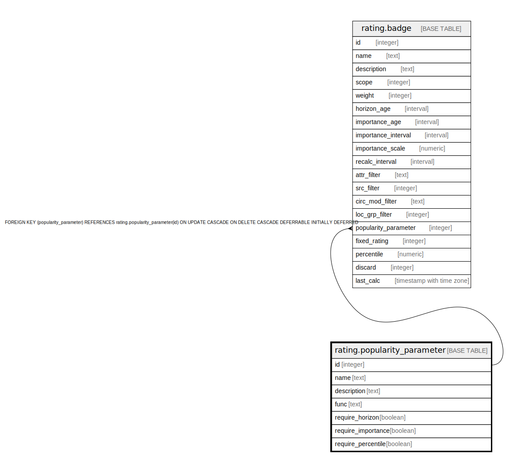

# rating.popularity_parameter

## Description

## Columns

| Name | Type | Default | Nullable | Children | Parents | Comment |
| ---- | ---- | ------- | -------- | -------- | ------- | ------- |
| id | integer |  | false | [rating.badge](rating.badge.md) |  |  |
| name | text |  | false |  |  |  |
| description | text |  | true |  |  |  |
| func | text |  | true |  |  |  |
| require_horizon | boolean | false | false |  |  |  |
| require_importance | boolean | false | false |  |  |  |
| require_percentile | boolean | false | false |  |  |  |

## Constraints

| Name | Type | Definition |
| ---- | ---- | ---------- |
| popularity_parameter_name_key | UNIQUE | UNIQUE (name) |
| popularity_parameter_pkey | PRIMARY KEY | PRIMARY KEY (id) |

## Indexes

| Name | Definition |
| ---- | ---------- |
| popularity_parameter_name_key | CREATE UNIQUE INDEX popularity_parameter_name_key ON rating.popularity_parameter USING btree (name) |
| popularity_parameter_pkey | CREATE UNIQUE INDEX popularity_parameter_pkey ON rating.popularity_parameter USING btree (id) |

## Relations

---

> Generated by [tbls](https://github.com/k1LoW/tbls)
