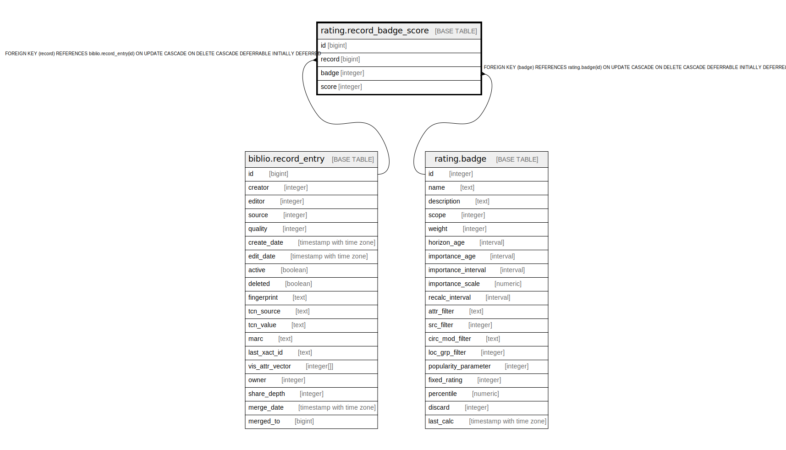

# rating.record_badge_score

## Description

## Columns

| Name | Type | Default | Nullable | Children | Parents | Comment |
| ---- | ---- | ------- | -------- | -------- | ------- | ------- |
| id | bigint | nextval('rating.record_badge_score_id_seq'::regclass) | false |  |  |  |
| record | bigint |  | false |  | [biblio.record_entry](biblio.record_entry.md) |  |
| badge | integer |  | false |  | [rating.badge](rating.badge.md) |  |
| score | integer |  | false |  |  |  |

## Constraints

| Name | Type | Definition |
| ---- | ---- | ---------- |
| record_badge_score_score_check | CHECK | CHECK (((score >= '-5'::integer) AND (score <= 5))) |
| record_badge_score_record_fkey | FOREIGN KEY | FOREIGN KEY (record) REFERENCES biblio.record_entry(id) ON UPDATE CASCADE ON DELETE CASCADE DEFERRABLE INITIALLY DEFERRED |
| record_badge_score_badge_fkey | FOREIGN KEY | FOREIGN KEY (badge) REFERENCES rating.badge(id) ON UPDATE CASCADE ON DELETE CASCADE DEFERRABLE INITIALLY DEFERRED |
| record_badge_score_pkey | PRIMARY KEY | PRIMARY KEY (id) |
| unique_record_badge | UNIQUE | UNIQUE (record, badge) |

## Indexes

| Name | Definition |
| ---- | ---------- |
| record_badge_score_pkey | CREATE UNIQUE INDEX record_badge_score_pkey ON rating.record_badge_score USING btree (id) |
| unique_record_badge | CREATE UNIQUE INDEX unique_record_badge ON rating.record_badge_score USING btree (record, badge) |
| record_badge_score_badge_idx | CREATE INDEX record_badge_score_badge_idx ON rating.record_badge_score USING btree (badge) |
| record_badge_score_record_idx | CREATE INDEX record_badge_score_record_idx ON rating.record_badge_score USING btree (record) |

## Relations

---

> Generated by [tbls](https://github.com/k1LoW/tbls)
