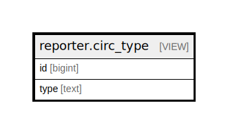

# reporter.circ_type

## Description

<details>
<summary><strong>Table Definition</strong></summary>

```sql
CREATE VIEW circ_type AS (
 SELECT circulation.id,
        CASE
            WHEN (circulation.opac_renewal OR circulation.phone_renewal OR circulation.desk_renewal OR circulation.auto_renewal) THEN 'RENEWAL'::text
            ELSE 'CHECKOUT'::text
        END AS type
   FROM action.circulation
)
```

</details>

## Columns

| Name | Type | Default | Nullable | Children | Parents | Comment |
| ---- | ---- | ------- | -------- | -------- | ------- | ------- |
| id | bigint |  | true |  |  |  |
| type | text |  | true |  |  |  |

## Referenced Tables

| Name | Columns | Comment | Type |
| ---- | ------- | ------- | ---- |
| [action.circulation](action.circulation.md) | 34 |  | BASE TABLE |

## Relations



---

> Generated by [tbls](https://github.com/k1LoW/tbls)
