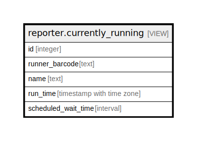

# reporter.currently_running

## Description

<details>
<summary><strong>Table Definition</strong></summary>

```sql
CREATE VIEW currently_running AS (
 SELECT s.id,
    c.barcode AS runner_barcode,
    r.name,
    s.run_time,
    (s.run_time - now()) AS scheduled_wait_time
   FROM (((reporter.schedule s
     JOIN reporter.report r ON ((r.id = s.report)))
     JOIN actor.usr u ON ((s.runner = u.id)))
     JOIN actor.card c ON ((c.id = u.card)))
  WHERE ((s.start_time IS NOT NULL) AND (s.complete_time IS NULL))
)
```

</details>

## Columns

| Name | Type | Default | Nullable | Children | Parents | Comment |
| ---- | ---- | ------- | -------- | -------- | ------- | ------- |
| id | integer |  | true |  |  |  |
| runner_barcode | text |  | true |  |  |  |
| name | text |  | true |  |  |  |
| run_time | timestamp with time zone |  | true |  |  |  |
| scheduled_wait_time | interval |  | true |  |  |  |

## Referenced Tables

| Name | Columns | Comment | Type |
| ---- | ------- | ------- | ---- |
| [reporter.schedule](reporter.schedule.md) | 16 |  | BASE TABLE |
| [reporter.report](reporter.report.md) | 10 |  | BASE TABLE |
| [actor.usr](actor.usr.md) | 49 | <br>User objects<br><br>This table contains the core User objects that describe both<br>staff members and patrons.  The difference between the two<br>types of users is based on the user's permissions.<br> | BASE TABLE |
| [actor.card](actor.card.md) | 4 | <br>Library Cards<br><br>Each User has one or more library cards.  The current "main"<br>card is linked to here from the actor.usr table, and it is up<br>to the consortium policy whether more than one card can be<br>active for any one user at a given time.<br> | BASE TABLE |

## Relations



---

> Generated by [tbls](https://github.com/k1LoW/tbls)
