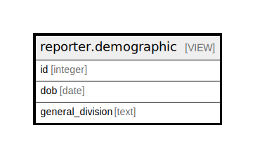

# reporter.demographic

## Description

<details>
<summary><strong>Table Definition</strong></summary>

```sql
CREATE VIEW demographic AS (
 SELECT u.id,
    u.dob,
        CASE
            WHEN (u.dob IS NULL) THEN 'Adult'::text
            WHEN (age((u.dob)::timestamp with time zone) > '18 years'::interval) THEN 'Adult'::text
            ELSE 'Juvenile'::text
        END AS general_division
   FROM actor.usr u
)
```

</details>

## Columns

| Name | Type | Default | Nullable | Children | Parents | Comment |
| ---- | ---- | ------- | -------- | -------- | ------- | ------- |
| id | integer |  | true |  |  |  |
| dob | date |  | true |  |  |  |
| general_division | text |  | true |  |  |  |

## Referenced Tables

| Name | Columns | Comment | Type |
| ---- | ------- | ------- | ---- |
| [actor.usr](actor.usr.md) | 49 | <br>User objects<br><br>This table contains the core User objects that describe both<br>staff members and patrons.  The difference between the two<br>types of users is based on the user's permissions.<br> | BASE TABLE |

## Relations



---

> Generated by [tbls](https://github.com/k1LoW/tbls)
