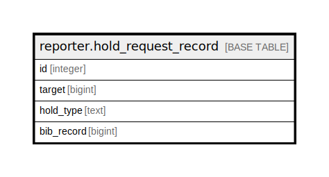

# reporter.hold_request_record

## Description

## Columns

| Name | Type | Default | Nullable | Children | Parents | Comment |
| ---- | ---- | ------- | -------- | -------- | ------- | ------- |
| id | integer |  | false |  |  |  |
| target | bigint |  | true |  |  |  |
| hold_type | text |  | true |  |  |  |
| bib_record | bigint |  | true |  |  |  |

## Constraints

| Name | Type | Definition |
| ---- | ---- | ---------- |
| reporter_hold_request_record_pkey_idx | PRIMARY KEY | PRIMARY KEY (id) |

## Indexes

| Name | Definition |
| ---- | ---------- |
| reporter_hold_request_record_pkey_idx | CREATE UNIQUE INDEX reporter_hold_request_record_pkey_idx ON reporter.hold_request_record USING btree (id) |
| reporter_hold_request_record_bib_record_idx | CREATE INDEX reporter_hold_request_record_bib_record_idx ON reporter.hold_request_record USING btree (bib_record) |

## Relations

---

> Generated by [tbls](https://github.com/k1LoW/tbls)
