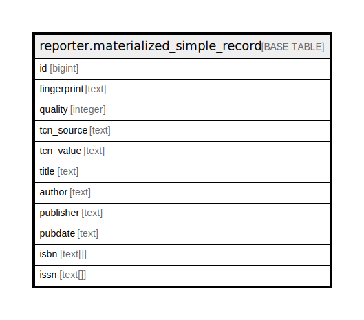

# reporter.materialized_simple_record

## Description

## Columns

| Name | Type | Default | Nullable | Children | Parents | Comment |
| ---- | ---- | ------- | -------- | -------- | ------- | ------- |
| id | bigint |  | false |  |  |  |
| fingerprint | text |  | true |  |  |  |
| quality | integer |  | true |  |  |  |
| tcn_source | text |  | true |  |  |  |
| tcn_value | text |  | true |  |  |  |
| title | text |  | true |  |  |  |
| author | text |  | true |  |  |  |
| publisher | text |  | true |  |  |  |
| pubdate | text |  | true |  |  |  |
| isbn | text[] |  | true |  |  |  |
| issn | text[] |  | true |  |  |  |

## Constraints

| Name | Type | Definition |
| ---- | ---- | ---------- |
| materialized_simple_record_pkey | PRIMARY KEY | PRIMARY KEY (id) |

## Indexes

| Name | Definition |
| ---- | ---------- |
| materialized_simple_record_pkey | CREATE UNIQUE INDEX materialized_simple_record_pkey ON reporter.materialized_simple_record USING btree (id) |

## Relations

---

> Generated by [tbls](https://github.com/k1LoW/tbls)
