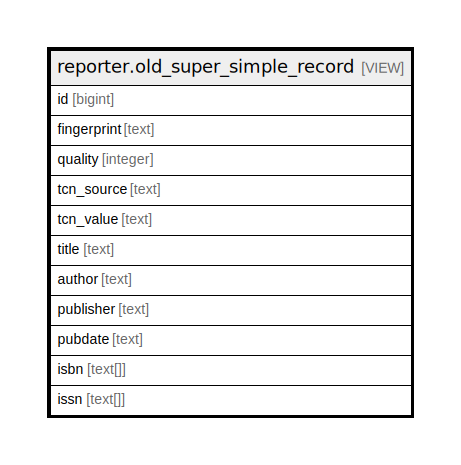

# reporter.old_super_simple_record

## Description

<details>
<summary><strong>Table Definition</strong></summary>

```sql
CREATE VIEW old_super_simple_record AS (
 SELECT r.id,
    r.fingerprint,
    r.quality,
    r.tcn_source,
    r.tcn_value,
    oils_json_to_text(d.title) AS title,
    oils_json_to_text(d.author) AS author,
    oils_json_to_text(d.publisher) AS publisher,
    oils_json_to_text(d.pubdate) AS pubdate,
        CASE
            WHEN (d.isbn = 'null'::text) THEN NULL::text[]
            ELSE ( SELECT ARRAY( SELECT json_array_elements_text((d.isbn)::json) AS json_array_elements_text) AS "array")
        END AS isbn,
        CASE
            WHEN (d.issn = 'null'::text) THEN NULL::text[]
            ELSE ( SELECT ARRAY( SELECT json_array_elements_text((d.issn)::json) AS json_array_elements_text) AS "array")
        END AS issn
   FROM (biblio.record_entry r
     JOIN metabib.wide_display_entry d ON ((r.id = d.source)))
)
```

</details>

## Columns

| Name | Type | Default | Nullable | Children | Parents | Comment |
| ---- | ---- | ------- | -------- | -------- | ------- | ------- |
| id | bigint |  | true |  |  |  |
| fingerprint | text |  | true |  |  |  |
| quality | integer |  | true |  |  |  |
| tcn_source | text |  | true |  |  |  |
| tcn_value | text |  | true |  |  |  |
| title | text |  | true |  |  |  |
| author | text |  | true |  |  |  |
| publisher | text |  | true |  |  |  |
| pubdate | text |  | true |  |  |  |
| isbn | text[] |  | true |  |  |  |
| issn | text[] |  | true |  |  |  |

## Referenced Tables

| Name | Columns | Comment | Type |
| ---- | ------- | ------- | ---- |
| [biblio.record_entry](biblio.record_entry.md) | 19 |  | BASE TABLE |
| [metabib.wide_display_entry](metabib.wide_display_entry.md) | 20 |  | VIEW |

## Relations



---

> Generated by [tbls](https://github.com/k1LoW/tbls)
