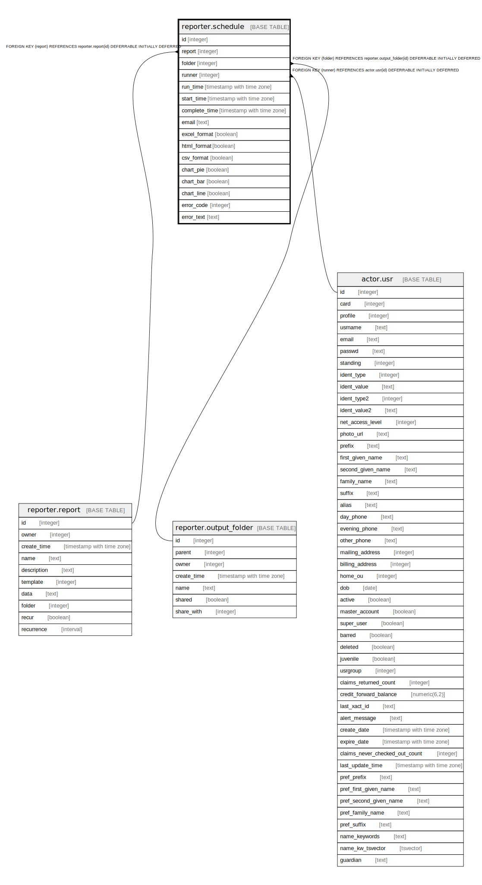

# reporter.schedule

## Description

## Columns

| Name | Type | Default | Nullable | Children | Parents | Comment |
| ---- | ---- | ------- | -------- | -------- | ------- | ------- |
| id | integer | nextval('reporter.schedule_id_seq'::regclass) | false |  |  |  |
| report | integer |  | false |  | [reporter.report](reporter.report.md) |  |
| folder | integer |  | false |  | [reporter.output_folder](reporter.output_folder.md) |  |
| runner | integer |  | false |  | [actor.usr](actor.usr.md) |  |
| run_time | timestamp with time zone | now() | false |  |  |  |
| start_time | timestamp with time zone |  | true |  |  |  |
| complete_time | timestamp with time zone |  | true |  |  |  |
| email | text |  | true |  |  |  |
| excel_format | boolean | true | false |  |  |  |
| html_format | boolean | true | false |  |  |  |
| csv_format | boolean | true | false |  |  |  |
| chart_pie | boolean | false | false |  |  |  |
| chart_bar | boolean | false | false |  |  |  |
| chart_line | boolean | false | false |  |  |  |
| error_code | integer |  | true |  |  |  |
| error_text | text |  | true |  |  |  |

## Constraints

| Name | Type | Definition |
| ---- | ---- | ---------- |
| schedule_runner_fkey | FOREIGN KEY | FOREIGN KEY (runner) REFERENCES actor.usr(id) DEFERRABLE INITIALLY DEFERRED |
| schedule_folder_fkey | FOREIGN KEY | FOREIGN KEY (folder) REFERENCES reporter.output_folder(id) DEFERRABLE INITIALLY DEFERRED |
| schedule_report_fkey | FOREIGN KEY | FOREIGN KEY (report) REFERENCES reporter.report(id) DEFERRABLE INITIALLY DEFERRED |
| schedule_pkey | PRIMARY KEY | PRIMARY KEY (id) |

## Indexes

| Name | Definition |
| ---- | ---------- |
| schedule_pkey | CREATE UNIQUE INDEX schedule_pkey ON reporter.schedule USING btree (id) |
| rpt_sched_folder_idx | CREATE INDEX rpt_sched_folder_idx ON reporter.schedule USING btree (folder) |
| rpt_sched_recurrence_once_idx | CREATE UNIQUE INDEX rpt_sched_recurrence_once_idx ON reporter.schedule USING btree (report, folder, runner, run_time, COALESCE(email, ''::text)) |
| rpt_sched_runner_idx | CREATE INDEX rpt_sched_runner_idx ON reporter.schedule USING btree (runner) |

## Relations

---

> Generated by [tbls](https://github.com/k1LoW/tbls)
