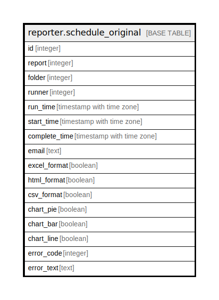

# reporter.schedule_original

## Description

## Columns

| Name | Type | Default | Nullable | Children | Parents | Comment |
| ---- | ---- | ------- | -------- | -------- | ------- | ------- |
| id | integer |  | false |  |  |  |
| report | integer |  | false |  |  |  |
| folder | integer |  | false |  |  |  |
| runner | integer |  | false |  |  |  |
| run_time | timestamp with time zone |  | false |  |  |  |
| start_time | timestamp with time zone |  | true |  |  |  |
| complete_time | timestamp with time zone |  | true |  |  |  |
| email | text |  | true |  |  |  |
| excel_format | boolean |  | false |  |  |  |
| html_format | boolean |  | false |  |  |  |
| csv_format | boolean |  | false |  |  |  |
| chart_pie | boolean |  | false |  |  |  |
| chart_bar | boolean |  | false |  |  |  |
| chart_line | boolean |  | false |  |  |  |
| error_code | integer |  | true |  |  |  |
| error_text | text |  | true |  |  |  |

## Relations

---

> Generated by [tbls](https://github.com/k1LoW/tbls)
