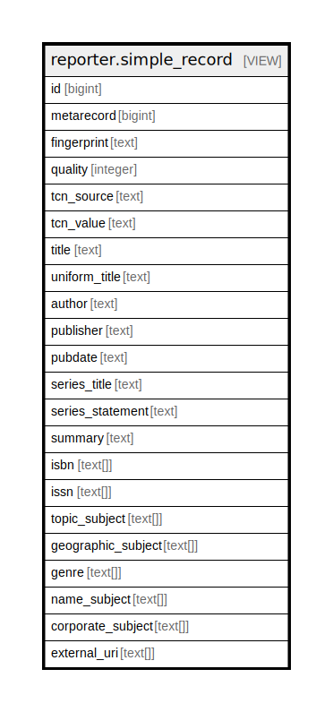

# reporter.simple_record

## Description

<details>
<summary><strong>Table Definition</strong></summary>

```sql
CREATE VIEW simple_record AS (
 SELECT r.id,
    s.metarecord,
    r.fingerprint,
    r.quality,
    r.tcn_source,
    r.tcn_value,
    title.value AS title,
    uniform_title.value AS uniform_title,
    author.value AS author,
    publisher.value AS publisher,
    "substring"(pubdate.value, '\d+'::text) AS pubdate,
    series_title.value AS series_title,
    series_statement.value AS series_statement,
    summary.value AS summary,
    array_agg(DISTINCT replace("substring"(isbn.value, '^\S+'::text), '-'::text, ''::text)) AS isbn,
    array_agg(DISTINCT regexp_replace(issn.value, '^\S*(\d{4})[-\s](\d{3,4}x?)'::text, '\1 \2'::text)) AS issn,
    ARRAY( SELECT DISTINCT full_rec.value
           FROM metabib.full_rec
          WHERE ((full_rec.tag = '650'::bpchar) AND (full_rec.subfield = 'a'::text) AND (full_rec.record = r.id))) AS topic_subject,
    ARRAY( SELECT DISTINCT full_rec.value
           FROM metabib.full_rec
          WHERE ((full_rec.tag = '651'::bpchar) AND (full_rec.subfield = 'a'::text) AND (full_rec.record = r.id))) AS geographic_subject,
    ARRAY( SELECT DISTINCT full_rec.value
           FROM metabib.full_rec
          WHERE ((full_rec.tag = '655'::bpchar) AND (full_rec.subfield = 'a'::text) AND (full_rec.record = r.id))) AS genre,
    ARRAY( SELECT DISTINCT full_rec.value
           FROM metabib.full_rec
          WHERE ((full_rec.tag = '600'::bpchar) AND (full_rec.subfield = 'a'::text) AND (full_rec.record = r.id))) AS name_subject,
    ARRAY( SELECT DISTINCT full_rec.value
           FROM metabib.full_rec
          WHERE ((full_rec.tag = '610'::bpchar) AND (full_rec.subfield = 'a'::text) AND (full_rec.record = r.id))) AS corporate_subject,
    ARRAY( SELECT full_rec.value
           FROM metabib.full_rec
          WHERE ((full_rec.tag = '856'::bpchar) AND (full_rec.subfield = ANY (ARRAY['3'::text, 'y'::text, 'u'::text])) AND (full_rec.record = r.id))
          ORDER BY
                CASE
                    WHEN (full_rec.subfield = ANY (ARRAY['3'::text, 'y'::text])) THEN 0
                    ELSE 1
                END) AS external_uri
   FROM (((((((((((biblio.record_entry r
     JOIN metabib.metarecord_source_map s ON ((s.source = r.id)))
     LEFT JOIN metabib.full_rec uniform_title ON (((r.id = uniform_title.record) AND (uniform_title.tag = '240'::bpchar) AND (uniform_title.subfield = 'a'::text))))
     LEFT JOIN metabib.full_rec title ON (((r.id = title.record) AND (title.tag = '245'::bpchar) AND (title.subfield = 'a'::text))))
     LEFT JOIN metabib.full_rec author ON (((r.id = author.record) AND (author.tag = '100'::bpchar) AND (author.subfield = 'a'::text))))
     LEFT JOIN metabib.full_rec publisher ON (((r.id = publisher.record) AND ((publisher.tag = '260'::bpchar) OR ((publisher.tag = '264'::bpchar) AND (publisher.ind2 = '1'::text))) AND (publisher.subfield = 'b'::text))))
     LEFT JOIN metabib.full_rec pubdate ON (((r.id = pubdate.record) AND ((pubdate.tag = '260'::bpchar) OR ((pubdate.tag = '264'::bpchar) AND (pubdate.ind2 = '1'::text))) AND (pubdate.subfield = 'c'::text))))
     LEFT JOIN metabib.full_rec isbn ON (((r.id = isbn.record) AND (isbn.tag = ANY (ARRAY['024'::bpchar, '020'::bpchar])) AND (isbn.subfield = ANY (ARRAY['a'::text, 'z'::text])))))
     LEFT JOIN metabib.full_rec issn ON (((r.id = issn.record) AND (issn.tag = '022'::bpchar) AND (issn.subfield = 'a'::text))))
     LEFT JOIN metabib.full_rec series_title ON (((r.id = series_title.record) AND (series_title.tag = ANY (ARRAY['830'::bpchar, '440'::bpchar])) AND (series_title.subfield = 'a'::text))))
     LEFT JOIN metabib.full_rec series_statement ON (((r.id = series_statement.record) AND (series_statement.tag = '490'::bpchar) AND (series_statement.subfield = 'a'::text))))
     LEFT JOIN metabib.full_rec summary ON (((r.id = summary.record) AND (summary.tag = '520'::bpchar) AND (summary.subfield = 'a'::text))))
  GROUP BY r.id, s.metarecord, r.fingerprint, r.quality, r.tcn_source, r.tcn_value, title.value, uniform_title.value, author.value, publisher.value, ("substring"(pubdate.value, '\d+'::text)), series_title.value, series_statement.value, summary.value
)
```

</details>

## Columns

| Name | Type | Default | Nullable | Children | Parents | Comment |
| ---- | ---- | ------- | -------- | -------- | ------- | ------- |
| id | bigint |  | true |  |  |  |
| metarecord | bigint |  | true |  |  |  |
| fingerprint | text |  | true |  |  |  |
| quality | integer |  | true |  |  |  |
| tcn_source | text |  | true |  |  |  |
| tcn_value | text |  | true |  |  |  |
| title | text |  | true |  |  |  |
| uniform_title | text |  | true |  |  |  |
| author | text |  | true |  |  |  |
| publisher | text |  | true |  |  |  |
| pubdate | text |  | true |  |  |  |
| series_title | text |  | true |  |  |  |
| series_statement | text |  | true |  |  |  |
| summary | text |  | true |  |  |  |
| isbn | text[] |  | true |  |  |  |
| issn | text[] |  | true |  |  |  |
| topic_subject | text[] |  | true |  |  |  |
| geographic_subject | text[] |  | true |  |  |  |
| genre | text[] |  | true |  |  |  |
| name_subject | text[] |  | true |  |  |  |
| corporate_subject | text[] |  | true |  |  |  |
| external_uri | text[] |  | true |  |  |  |

## Referenced Tables

| Name | Columns | Comment | Type |
| ---- | ------- | ------- | ---- |
| [metabib.full_rec](metabib.full_rec.md) | 8 |  | VIEW |
| [biblio.record_entry](biblio.record_entry.md) | 19 |  | BASE TABLE |
| [metabib.metarecord_source_map](metabib.metarecord_source_map.md) | 3 |  | BASE TABLE |

## Relations



---

> Generated by [tbls](https://github.com/k1LoW/tbls)
