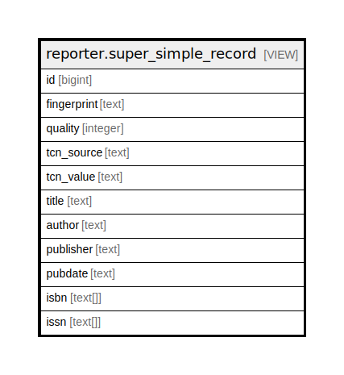

# reporter.super_simple_record

## Description

<details>
<summary><strong>Table Definition</strong></summary>

```sql
CREATE VIEW super_simple_record AS (
 SELECT materialized_simple_record.id,
    materialized_simple_record.fingerprint,
    materialized_simple_record.quality,
    materialized_simple_record.tcn_source,
    materialized_simple_record.tcn_value,
    materialized_simple_record.title,
    materialized_simple_record.author,
    materialized_simple_record.publisher,
    materialized_simple_record.pubdate,
    materialized_simple_record.isbn,
    materialized_simple_record.issn
   FROM reporter.materialized_simple_record
)
```

</details>

## Columns

| Name | Type | Default | Nullable | Children | Parents | Comment |
| ---- | ---- | ------- | -------- | -------- | ------- | ------- |
| id | bigint |  | true |  |  |  |
| fingerprint | text |  | true |  |  |  |
| quality | integer |  | true |  |  |  |
| tcn_source | text |  | true |  |  |  |
| tcn_value | text |  | true |  |  |  |
| title | text |  | true |  |  |  |
| author | text |  | true |  |  |  |
| publisher | text |  | true |  |  |  |
| pubdate | text |  | true |  |  |  |
| isbn | text[] |  | true |  |  |  |
| issn | text[] |  | true |  |  |  |

## Referenced Tables

| Name | Columns | Comment | Type |
| ---- | ------- | ------- | ---- |
| [reporter.materialized_simple_record](reporter.materialized_simple_record.md) | 11 |  | BASE TABLE |

## Relations



---

> Generated by [tbls](https://github.com/k1LoW/tbls)
