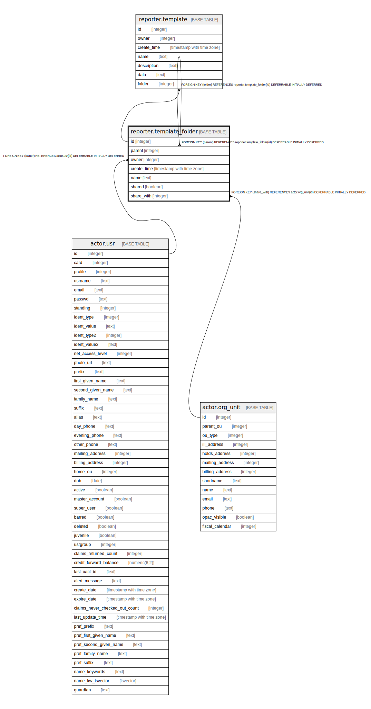

# reporter.template_folder

## Description

## Columns

| Name | Type | Default | Nullable | Children | Parents | Comment |
| ---- | ---- | ------- | -------- | -------- | ------- | ------- |
| id | integer | nextval('reporter.template_folder_id_seq'::regclass) | false | [reporter.template](reporter.template.md) [reporter.template_folder](reporter.template_folder.md) |  |  |
| parent | integer |  | true |  | [reporter.template_folder](reporter.template_folder.md) |  |
| owner | integer |  | false |  | [actor.usr](actor.usr.md) |  |
| create_time | timestamp with time zone | now() | false |  |  |  |
| name | text |  | false |  |  |  |
| shared | boolean | false | false |  |  |  |
| share_with | integer |  | true |  | [actor.org_unit](actor.org_unit.md) |  |

## Constraints

| Name | Type | Definition |
| ---- | ---- | ---------- |
| template_folder_share_with_fkey | FOREIGN KEY | FOREIGN KEY (share_with) REFERENCES actor.org_unit(id) DEFERRABLE INITIALLY DEFERRED |
| template_folder_owner_fkey | FOREIGN KEY | FOREIGN KEY (owner) REFERENCES actor.usr(id) DEFERRABLE INITIALLY DEFERRED |
| template_folder_parent_fkey | FOREIGN KEY | FOREIGN KEY (parent) REFERENCES reporter.template_folder(id) DEFERRABLE INITIALLY DEFERRED |
| template_folder_pkey | PRIMARY KEY | PRIMARY KEY (id) |

## Indexes

| Name | Definition |
| ---- | ---------- |
| template_folder_pkey | CREATE UNIQUE INDEX template_folder_pkey ON reporter.template_folder USING btree (id) |
| rpt_template_folder_once_idx | CREATE UNIQUE INDEX rpt_template_folder_once_idx ON reporter.template_folder USING btree (name, owner) WHERE (parent IS NULL) |
| rpt_template_folder_once_parent_idx | CREATE UNIQUE INDEX rpt_template_folder_once_parent_idx ON reporter.template_folder USING btree (name, parent) |
| rpt_tmpl_fldr_owner_idx | CREATE INDEX rpt_tmpl_fldr_owner_idx ON reporter.template_folder USING btree (owner) |

## Relations

---

> Generated by [tbls](https://github.com/k1LoW/tbls)
