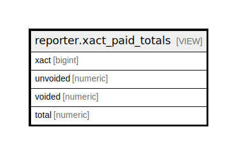

# reporter.xact_paid_totals

## Description

<details>
<summary><strong>Table Definition</strong></summary>

```sql
CREATE VIEW xact_paid_totals AS (
 SELECT b.xact,
    sum(
        CASE
            WHEN b.voided THEN (0)::numeric
            ELSE b.amount
        END) AS unvoided,
    sum(
        CASE
            WHEN b.voided THEN b.amount
            ELSE (0)::numeric
        END) AS voided,
    sum(b.amount) AS total
   FROM money.payment b
  GROUP BY b.xact
)
```

</details>

## Columns

| Name | Type | Default | Nullable | Children | Parents | Comment |
| ---- | ---- | ------- | -------- | -------- | ------- | ------- |
| xact | bigint |  | true |  |  |  |
| unvoided | numeric |  | true |  |  |  |
| voided | numeric |  | true |  |  |  |
| total | numeric |  | true |  |  |  |

## Referenced Tables

| Name | Columns | Comment | Type |
| ---- | ------- | ------- | ---- |
| [money.payment](money.payment.md) | 6 |  | BASE TABLE |

## Relations



---

> Generated by [tbls](https://github.com/k1LoW/tbls)
