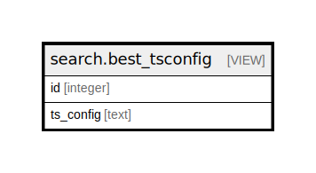

# search.best_tsconfig

## Description

<details>
<summary><strong>Table Definition</strong></summary>

```sql
CREATE VIEW best_tsconfig AS (
 SELECT m.id,
    COALESCE(f.ts_config, c.ts_config, 'simple'::text) AS ts_config
   FROM ((config.metabib_field m
     LEFT JOIN config.metabib_class_ts_map c ON (((c.field_class = m.field_class) AND (c.index_weight = 'C'::bpchar))))
     LEFT JOIN config.metabib_field_ts_map f ON (((f.metabib_field = m.id) AND (f.index_weight = 'C'::bpchar))))
)
```

</details>

## Columns

| Name | Type | Default | Nullable | Children | Parents | Comment |
| ---- | ---- | ------- | -------- | -------- | ------- | ------- |
| id | integer |  | true |  |  |  |
| ts_config | text |  | true |  |  |  |

## Referenced Tables

| Name | Columns | Comment | Type |
| ---- | ------- | ------- | ---- |
| [config.metabib_field](config.metabib_field.md) | 18 | <br>XPath used for record indexing ingest<br><br>This table contains the XPath used to chop up MODS into its<br>indexable parts.  Each XPath entry is named and assigned to<br>a "class" of either title, subject, author, keyword, series<br>or identifier.<br> | BASE TABLE |
| [config.metabib_class_ts_map](config.metabib_class_ts_map.md) | 8 | <br>Text Search Configs for metabib class indexing<br><br>This table contains text search config definitions for<br>storing index_vector values.<br> | BASE TABLE |
| [config.metabib_field_ts_map](config.metabib_field_ts_map.md) | 7 | <br>Text Search Configs for metabib field indexing<br><br>This table contains text search config definitions for<br>storing index_vector values.<br> | BASE TABLE |

## Relations



---

> Generated by [tbls](https://github.com/k1LoW/tbls)
