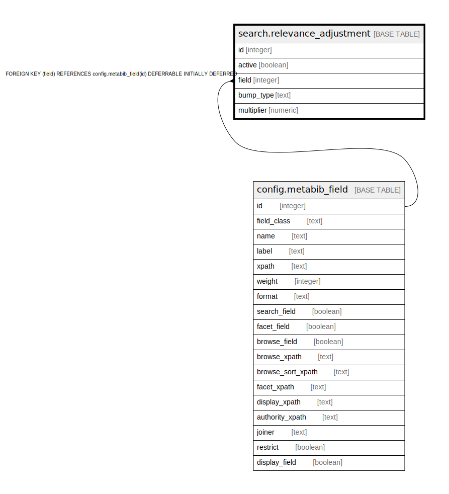

# search.relevance_adjustment

## Description

## Columns

| Name | Type | Default | Nullable | Children | Parents | Comment |
| ---- | ---- | ------- | -------- | -------- | ------- | ------- |
| id | integer | nextval('search.relevance_adjustment_id_seq'::regclass) | false |  |  |  |
| active | boolean | true | false |  |  |  |
| field | integer |  | false |  | [config.metabib_field](config.metabib_field.md) |  |
| bump_type | text |  | false |  |  |  |
| multiplier | numeric | 1.0 | false |  |  |  |

## Constraints

| Name | Type | Definition |
| ---- | ---- | ---------- |
| relevance_adjustment_bump_type_check | CHECK | CHECK ((bump_type = ANY (ARRAY['word_order'::text, 'first_word'::text, 'full_match'::text]))) |
| relevance_adjustment_field_fkey | FOREIGN KEY | FOREIGN KEY (field) REFERENCES config.metabib_field(id) DEFERRABLE INITIALLY DEFERRED |
| relevance_adjustment_pkey | PRIMARY KEY | PRIMARY KEY (id) |

## Indexes

| Name | Definition |
| ---- | ---------- |
| relevance_adjustment_pkey | CREATE UNIQUE INDEX relevance_adjustment_pkey ON search.relevance_adjustment USING btree (id) |
| bump_once_per_field_idx | CREATE UNIQUE INDEX bump_once_per_field_idx ON search.relevance_adjustment USING btree (field, bump_type) |

## Relations

---

> Generated by [tbls](https://github.com/k1LoW/tbls)
