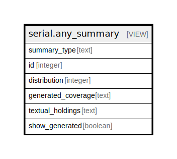

# serial.any_summary

## Description

<details>
<summary><strong>Table Definition</strong></summary>

```sql
CREATE VIEW any_summary AS (
 SELECT 'basic'::text AS summary_type,
    basic_summary.id,
    basic_summary.distribution,
    basic_summary.generated_coverage,
    basic_summary.textual_holdings,
    basic_summary.show_generated
   FROM serial.basic_summary
UNION
 SELECT 'index'::text AS summary_type,
    index_summary.id,
    index_summary.distribution,
    index_summary.generated_coverage,
    index_summary.textual_holdings,
    index_summary.show_generated
   FROM serial.index_summary
UNION
 SELECT 'supplement'::text AS summary_type,
    supplement_summary.id,
    supplement_summary.distribution,
    supplement_summary.generated_coverage,
    supplement_summary.textual_holdings,
    supplement_summary.show_generated
   FROM serial.supplement_summary
)
```

</details>

## Columns

| Name | Type | Default | Nullable | Children | Parents | Comment |
| ---- | ---- | ------- | -------- | -------- | ------- | ------- |
| summary_type | text |  | true |  |  |  |
| id | integer |  | true |  |  |  |
| distribution | integer |  | true |  |  |  |
| generated_coverage | text |  | true |  |  |  |
| textual_holdings | text |  | true |  |  |  |
| show_generated | boolean |  | true |  |  |  |

## Referenced Tables

| Name | Columns | Comment | Type |
| ---- | ------- | ------- | ---- |
| [serial.basic_summary](serial.basic_summary.md) | 5 |  | BASE TABLE |
| [serial.index_summary](serial.index_summary.md) | 5 |  | BASE TABLE |
| [serial.supplement_summary](serial.supplement_summary.md) | 5 |  | BASE TABLE |

## Relations



---

> Generated by [tbls](https://github.com/k1LoW/tbls)
