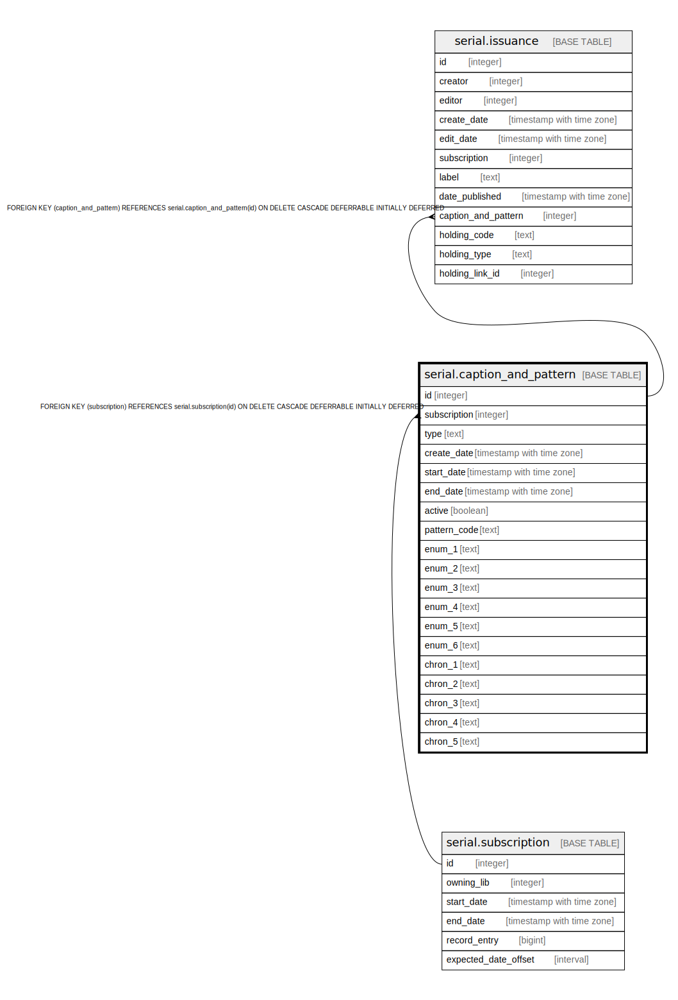

# serial.caption_and_pattern

## Description

## Columns

| Name | Type | Default | Nullable | Children | Parents | Comment |
| ---- | ---- | ------- | -------- | -------- | ------- | ------- |
| id | integer | nextval('serial.caption_and_pattern_id_seq'::regclass) | false | [serial.issuance](serial.issuance.md) |  |  |
| subscription | integer |  | false |  | [serial.subscription](serial.subscription.md) |  |
| type | text |  | false |  |  |  |
| create_date | timestamp with time zone | now() | false |  |  |  |
| start_date | timestamp with time zone | now() | false |  |  |  |
| end_date | timestamp with time zone |  | true |  |  |  |
| active | boolean | false | false |  |  |  |
| pattern_code | text |  | false |  |  |  |
| enum_1 | text |  | true |  |  |  |
| enum_2 | text |  | true |  |  |  |
| enum_3 | text |  | true |  |  |  |
| enum_4 | text |  | true |  |  |  |
| enum_5 | text |  | true |  |  |  |
| enum_6 | text |  | true |  |  |  |
| chron_1 | text |  | true |  |  |  |
| chron_2 | text |  | true |  |  |  |
| chron_3 | text |  | true |  |  |  |
| chron_4 | text |  | true |  |  |  |
| chron_5 | text |  | true |  |  |  |

## Constraints

| Name | Type | Definition |
| ---- | ---- | ---------- |
| cap_type | CHECK | CHECK ((type = ANY (ARRAY['basic'::text, 'supplement'::text, 'index'::text]))) |
| caption_and_pattern_pkey | PRIMARY KEY | PRIMARY KEY (id) |
| caption_and_pattern_subscription_fkey | FOREIGN KEY | FOREIGN KEY (subscription) REFERENCES serial.subscription(id) ON DELETE CASCADE DEFERRABLE INITIALLY DEFERRED |

## Indexes

| Name | Definition |
| ---- | ---------- |
| caption_and_pattern_pkey | CREATE UNIQUE INDEX caption_and_pattern_pkey ON serial.caption_and_pattern USING btree (id) |
| serial_caption_and_pattern_sub_idx | CREATE INDEX serial_caption_and_pattern_sub_idx ON serial.caption_and_pattern USING btree (subscription) |

## Relations

---

> Generated by [tbls](https://github.com/k1LoW/tbls)
