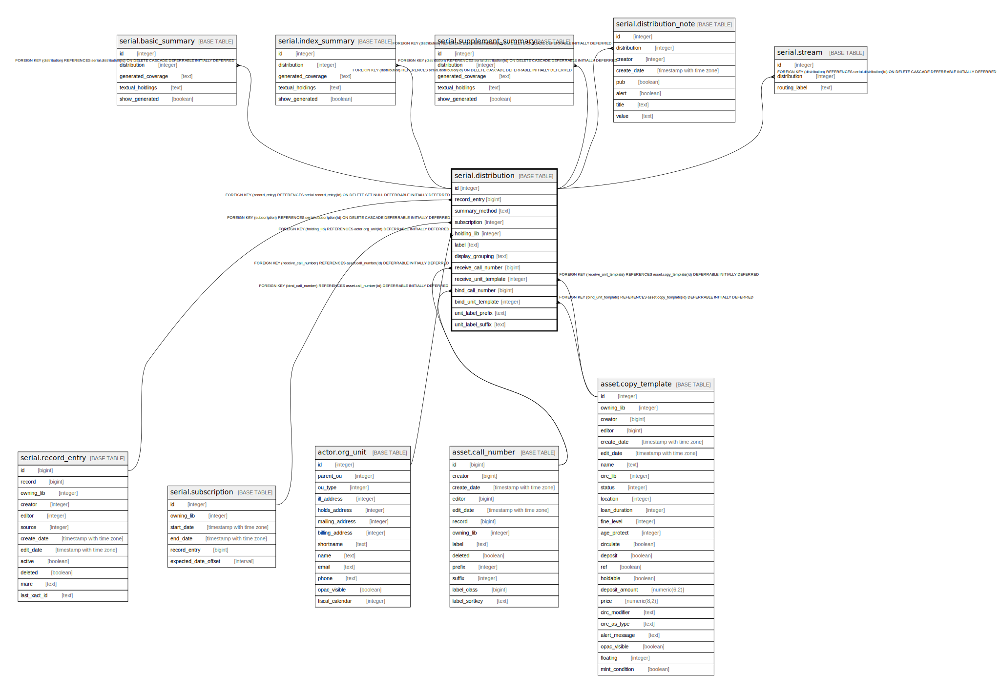

# serial.distribution

## Description

## Columns

| Name | Type | Default | Nullable | Children | Parents | Comment |
| ---- | ---- | ------- | -------- | -------- | ------- | ------- |
| id | integer | nextval('serial.distribution_id_seq'::regclass) | false | [serial.basic_summary](serial.basic_summary.md) [serial.index_summary](serial.index_summary.md) [serial.supplement_summary](serial.supplement_summary.md) [serial.distribution_note](serial.distribution_note.md) [serial.stream](serial.stream.md) |  |  |
| record_entry | bigint |  | true |  | [serial.record_entry](serial.record_entry.md) |  |
| summary_method | text |  | true |  |  |  |
| subscription | integer |  | false |  | [serial.subscription](serial.subscription.md) |  |
| holding_lib | integer |  | false |  | [actor.org_unit](actor.org_unit.md) |  |
| label | text |  | false |  |  |  |
| display_grouping | text | 'chron'::text | false |  |  |  |
| receive_call_number | bigint |  | true |  | [asset.call_number](asset.call_number.md) |  |
| receive_unit_template | integer |  | true |  | [asset.copy_template](asset.copy_template.md) |  |
| bind_call_number | bigint |  | true |  | [asset.call_number](asset.call_number.md) |  |
| bind_unit_template | integer |  | true |  | [asset.copy_template](asset.copy_template.md) |  |
| unit_label_prefix | text |  | true |  |  |  |
| unit_label_suffix | text |  | true |  |  |  |

## Constraints

| Name | Type | Definition |
| ---- | ---- | ---------- |
| distribution_display_grouping_check | CHECK | CHECK ((display_grouping = ANY (ARRAY['enum'::text, 'chron'::text]))) |
| sdist_summary_method_check | CHECK | CHECK (((summary_method IS NULL) OR (summary_method = ANY (ARRAY['add_to_sre'::text, 'merge_with_sre'::text, 'use_sre_only'::text, 'use_sdist_only'::text])))) |
| distribution_holding_lib_fkey | FOREIGN KEY | FOREIGN KEY (holding_lib) REFERENCES actor.org_unit(id) DEFERRABLE INITIALLY DEFERRED |
| distribution_bind_call_number_fkey | FOREIGN KEY | FOREIGN KEY (bind_call_number) REFERENCES asset.call_number(id) DEFERRABLE INITIALLY DEFERRED |
| distribution_receive_call_number_fkey | FOREIGN KEY | FOREIGN KEY (receive_call_number) REFERENCES asset.call_number(id) DEFERRABLE INITIALLY DEFERRED |
| distribution_bind_unit_template_fkey | FOREIGN KEY | FOREIGN KEY (bind_unit_template) REFERENCES asset.copy_template(id) DEFERRABLE INITIALLY DEFERRED |
| distribution_receive_unit_template_fkey | FOREIGN KEY | FOREIGN KEY (receive_unit_template) REFERENCES asset.copy_template(id) DEFERRABLE INITIALLY DEFERRED |
| distribution_pkey | PRIMARY KEY | PRIMARY KEY (id) |
| distribution_record_entry_fkey | FOREIGN KEY | FOREIGN KEY (record_entry) REFERENCES serial.record_entry(id) ON DELETE SET NULL DEFERRABLE INITIALLY DEFERRED |
| distribution_subscription_fkey | FOREIGN KEY | FOREIGN KEY (subscription) REFERENCES serial.subscription(id) ON DELETE CASCADE DEFERRABLE INITIALLY DEFERRED |

## Indexes

| Name | Definition |
| ---- | ---------- |
| distribution_pkey | CREATE UNIQUE INDEX distribution_pkey ON serial.distribution USING btree (id) |
| one_dist_per_sre_idx | CREATE UNIQUE INDEX one_dist_per_sre_idx ON serial.distribution USING btree (record_entry) |
| serial_distribution_holding_lib_idx | CREATE INDEX serial_distribution_holding_lib_idx ON serial.distribution USING btree (holding_lib) |
| serial_distribution_sub_idx | CREATE INDEX serial_distribution_sub_idx ON serial.distribution USING btree (subscription) |

## Relations

---

> Generated by [tbls](https://github.com/k1LoW/tbls)
