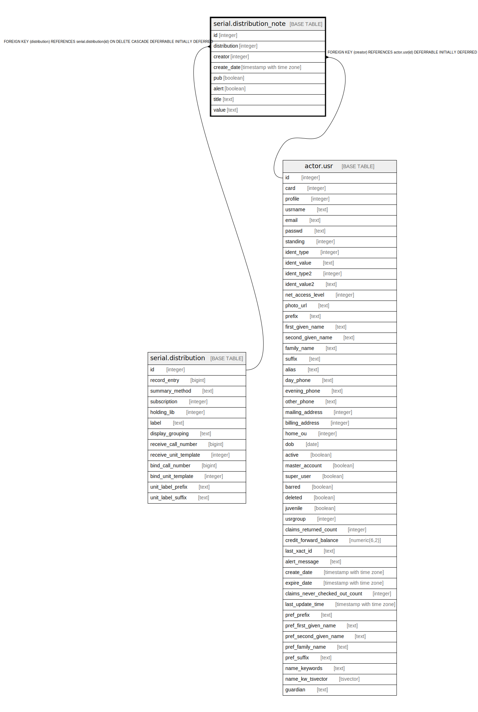

# serial.distribution_note

## Description

## Columns

| Name | Type | Default | Nullable | Children | Parents | Comment |
| ---- | ---- | ------- | -------- | -------- | ------- | ------- |
| id | integer | nextval('serial.distribution_note_id_seq'::regclass) | false |  |  |  |
| distribution | integer |  | false |  | [serial.distribution](serial.distribution.md) |  |
| creator | integer |  | false |  | [actor.usr](actor.usr.md) |  |
| create_date | timestamp with time zone | now() | true |  |  |  |
| pub | boolean | false | false |  |  |  |
| alert | boolean | false | false |  |  |  |
| title | text |  | false |  |  |  |
| value | text |  | false |  |  |  |

## Constraints

| Name | Type | Definition |
| ---- | ---- | ---------- |
| distribution_note_creator_fkey | FOREIGN KEY | FOREIGN KEY (creator) REFERENCES actor.usr(id) DEFERRABLE INITIALLY DEFERRED |
| distribution_note_pkey | PRIMARY KEY | PRIMARY KEY (id) |
| distribution_note_distribution_fkey | FOREIGN KEY | FOREIGN KEY (distribution) REFERENCES serial.distribution(id) ON DELETE CASCADE DEFERRABLE INITIALLY DEFERRED |

## Indexes

| Name | Definition |
| ---- | ---------- |
| distribution_note_pkey | CREATE UNIQUE INDEX distribution_note_pkey ON serial.distribution_note USING btree (id) |
| serial_distribution_note_dist_idx | CREATE INDEX serial_distribution_note_dist_idx ON serial.distribution_note USING btree (distribution) |

## Relations

---

> Generated by [tbls](https://github.com/k1LoW/tbls)
