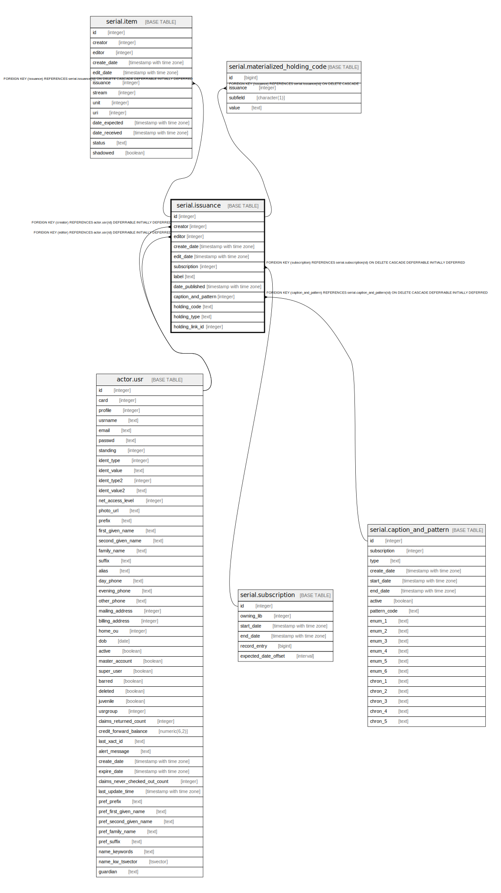

# serial.issuance

## Description

## Columns

| Name | Type | Default | Nullable | Children | Parents | Comment |
| ---- | ---- | ------- | -------- | -------- | ------- | ------- |
| id | integer | nextval('serial.issuance_id_seq'::regclass) | false | [serial.item](serial.item.md) [serial.materialized_holding_code](serial.materialized_holding_code.md) |  |  |
| creator | integer |  | false |  | [actor.usr](actor.usr.md) |  |
| editor | integer |  | false |  | [actor.usr](actor.usr.md) |  |
| create_date | timestamp with time zone | now() | false |  |  |  |
| edit_date | timestamp with time zone | now() | false |  |  |  |
| subscription | integer |  | false |  | [serial.subscription](serial.subscription.md) |  |
| label | text |  | true |  |  |  |
| date_published | timestamp with time zone |  | true |  |  |  |
| caption_and_pattern | integer |  | true |  | [serial.caption_and_pattern](serial.caption_and_pattern.md) |  |
| holding_code | text |  | true |  |  |  |
| holding_type | text |  | true |  |  |  |
| holding_link_id | integer |  | true |  |  |  |

## Constraints

| Name | Type | Definition |
| ---- | ---- | ---------- |
| issuance_holding_code_check | CHECK | CHECK (((holding_code IS NULL) OR could_be_serial_holding_code(holding_code))) |
| issuance_holding_code_check1 | CHECK | CHECK (((holding_code IS NULL) OR is_json(holding_code))) |
| valid_holding_type | CHECK | CHECK (((holding_type IS NULL) OR (holding_type = ANY (ARRAY['basic'::text, 'supplement'::text, 'index'::text])))) |
| issuance_creator_fkey | FOREIGN KEY | FOREIGN KEY (creator) REFERENCES actor.usr(id) DEFERRABLE INITIALLY DEFERRED |
| issuance_editor_fkey | FOREIGN KEY | FOREIGN KEY (editor) REFERENCES actor.usr(id) DEFERRABLE INITIALLY DEFERRED |
| issuance_caption_and_pattern_fkey | FOREIGN KEY | FOREIGN KEY (caption_and_pattern) REFERENCES serial.caption_and_pattern(id) ON DELETE CASCADE DEFERRABLE INITIALLY DEFERRED |
| issuance_pkey | PRIMARY KEY | PRIMARY KEY (id) |
| issuance_subscription_fkey | FOREIGN KEY | FOREIGN KEY (subscription) REFERENCES serial.subscription(id) ON DELETE CASCADE DEFERRABLE INITIALLY DEFERRED |

## Indexes

| Name | Definition |
| ---- | ---------- |
| issuance_pkey | CREATE UNIQUE INDEX issuance_pkey ON serial.issuance USING btree (id) |
| serial_issuance_caption_and_pattern_idx | CREATE INDEX serial_issuance_caption_and_pattern_idx ON serial.issuance USING btree (caption_and_pattern) |
| serial_issuance_date_published_idx | CREATE INDEX serial_issuance_date_published_idx ON serial.issuance USING btree (date_published) |
| serial_issuance_sub_idx | CREATE INDEX serial_issuance_sub_idx ON serial.issuance USING btree (subscription) |

## Triggers

| Name | Definition |
| ---- | ---------- |
| materialize_holding_code | CREATE TRIGGER materialize_holding_code AFTER INSERT OR UPDATE ON serial.issuance FOR EACH ROW EXECUTE PROCEDURE serial.materialize_holding_code() |

## Relations

---

> Generated by [tbls](https://github.com/k1LoW/tbls)
