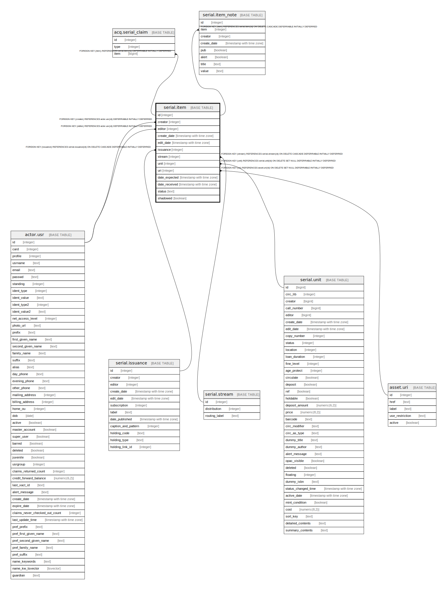

# serial.item

## Description

## Columns

| Name | Type | Default | Nullable | Children | Parents | Comment |
| ---- | ---- | ------- | -------- | -------- | ------- | ------- |
| id | integer | nextval('serial.item_id_seq'::regclass) | false | [acq.serial_claim](acq.serial_claim.md) [serial.item_note](serial.item_note.md) |  |  |
| creator | integer |  | false |  | [actor.usr](actor.usr.md) |  |
| editor | integer |  | false |  | [actor.usr](actor.usr.md) |  |
| create_date | timestamp with time zone | now() | false |  |  |  |
| edit_date | timestamp with time zone | now() | false |  |  |  |
| issuance | integer |  | false |  | [serial.issuance](serial.issuance.md) |  |
| stream | integer |  | false |  | [serial.stream](serial.stream.md) |  |
| unit | integer |  | true |  | [serial.unit](serial.unit.md) |  |
| uri | integer |  | true |  | [asset.uri](asset.uri.md) |  |
| date_expected | timestamp with time zone |  | true |  |  |  |
| date_received | timestamp with time zone |  | true |  |  |  |
| status | text | 'Expected'::text | true |  |  |  |
| shadowed | boolean | false | false |  |  |  |

## Constraints

| Name | Type | Definition |
| ---- | ---- | ---------- |
| valid_status | CHECK | CHECK ((status = ANY (ARRAY['Bindery'::text, 'Bound'::text, 'Claimed'::text, 'Discarded'::text, 'Expected'::text, 'Not Held'::text, 'Not Published'::text, 'Received'::text]))) |
| item_creator_fkey | FOREIGN KEY | FOREIGN KEY (creator) REFERENCES actor.usr(id) DEFERRABLE INITIALLY DEFERRED |
| item_editor_fkey | FOREIGN KEY | FOREIGN KEY (editor) REFERENCES actor.usr(id) DEFERRABLE INITIALLY DEFERRED |
| item_uri_fkey | FOREIGN KEY | FOREIGN KEY (uri) REFERENCES asset.uri(id) ON DELETE SET NULL DEFERRABLE INITIALLY DEFERRED |
| item_issuance_fkey | FOREIGN KEY | FOREIGN KEY (issuance) REFERENCES serial.issuance(id) ON DELETE CASCADE DEFERRABLE INITIALLY DEFERRED |
| item_pkey | PRIMARY KEY | PRIMARY KEY (id) |
| item_stream_fkey | FOREIGN KEY | FOREIGN KEY (stream) REFERENCES serial.stream(id) ON DELETE CASCADE DEFERRABLE INITIALLY DEFERRED |
| item_unit_fkey | FOREIGN KEY | FOREIGN KEY (unit) REFERENCES serial.unit(id) ON DELETE SET NULL DEFERRABLE INITIALLY DEFERRED |

## Indexes

| Name | Definition |
| ---- | ---------- |
| item_pkey | CREATE UNIQUE INDEX item_pkey ON serial.item USING btree (id) |
| serial_item_date_received_idx | CREATE INDEX serial_item_date_received_idx ON serial.item USING btree (date_received) |
| serial_item_issuance_idx | CREATE INDEX serial_item_issuance_idx ON serial.item USING btree (issuance) |
| serial_item_status_idx | CREATE INDEX serial_item_status_idx ON serial.item USING btree (status) |
| serial_item_stream_idx | CREATE INDEX serial_item_stream_idx ON serial.item USING btree (stream) |
| serial_item_unit_idx | CREATE INDEX serial_item_unit_idx ON serial.item USING btree (unit) |
| serial_item_uri_idx | CREATE INDEX serial_item_uri_idx ON serial.item USING btree (uri) |

## Relations

---

> Generated by [tbls](https://github.com/k1LoW/tbls)
