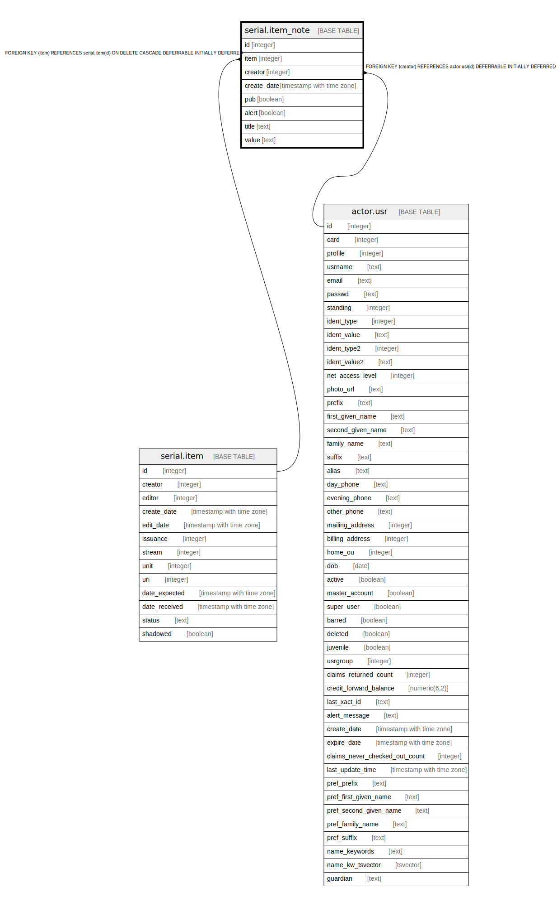

# serial.item_note

## Description

## Columns

| Name | Type | Default | Nullable | Children | Parents | Comment |
| ---- | ---- | ------- | -------- | -------- | ------- | ------- |
| id | integer | nextval('serial.item_note_id_seq'::regclass) | false |  |  |  |
| item | integer |  | false |  | [serial.item](serial.item.md) |  |
| creator | integer |  | false |  | [actor.usr](actor.usr.md) |  |
| create_date | timestamp with time zone | now() | true |  |  |  |
| pub | boolean | false | false |  |  |  |
| alert | boolean | false | false |  |  |  |
| title | text |  | false |  |  |  |
| value | text |  | false |  |  |  |

## Constraints

| Name | Type | Definition |
| ---- | ---- | ---------- |
| item_note_creator_fkey | FOREIGN KEY | FOREIGN KEY (creator) REFERENCES actor.usr(id) DEFERRABLE INITIALLY DEFERRED |
| item_note_pkey | PRIMARY KEY | PRIMARY KEY (id) |
| item_note_item_fkey | FOREIGN KEY | FOREIGN KEY (item) REFERENCES serial.item(id) ON DELETE CASCADE DEFERRABLE INITIALLY DEFERRED |

## Indexes

| Name | Definition |
| ---- | ---------- |
| item_note_pkey | CREATE UNIQUE INDEX item_note_pkey ON serial.item_note USING btree (id) |
| serial_item_note_item_idx | CREATE INDEX serial_item_note_item_idx ON serial.item_note USING btree (item) |

## Relations

---

> Generated by [tbls](https://github.com/k1LoW/tbls)
