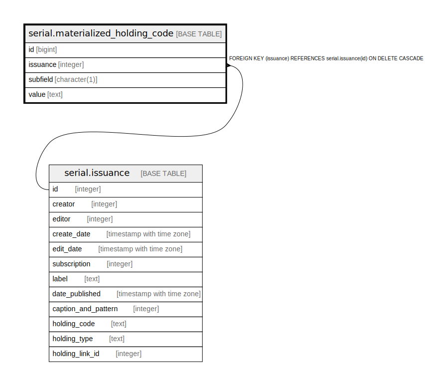

# serial.materialized_holding_code

## Description

## Columns

| Name | Type | Default | Nullable | Children | Parents | Comment |
| ---- | ---- | ------- | -------- | -------- | ------- | ------- |
| id | bigint | nextval('serial.materialized_holding_code_id_seq'::regclass) | false |  |  |  |
| issuance | integer |  | false |  | [serial.issuance](serial.issuance.md) |  |
| subfield | character(1) |  | true |  |  |  |
| value | text |  | true |  |  |  |

## Constraints

| Name | Type | Definition |
| ---- | ---- | ---------- |
| materialized_holding_code_issuance_fkey | FOREIGN KEY | FOREIGN KEY (issuance) REFERENCES serial.issuance(id) ON DELETE CASCADE |
| materialized_holding_code_pkey | PRIMARY KEY | PRIMARY KEY (id) |

## Indexes

| Name | Definition |
| ---- | ---------- |
| materialized_holding_code_pkey | CREATE UNIQUE INDEX materialized_holding_code_pkey ON serial.materialized_holding_code USING btree (id) |
| assist_holdings_display | CREATE INDEX assist_holdings_display ON serial.materialized_holding_code USING btree (issuance, subfield) |

## Relations

---

> Generated by [tbls](https://github.com/k1LoW/tbls)
