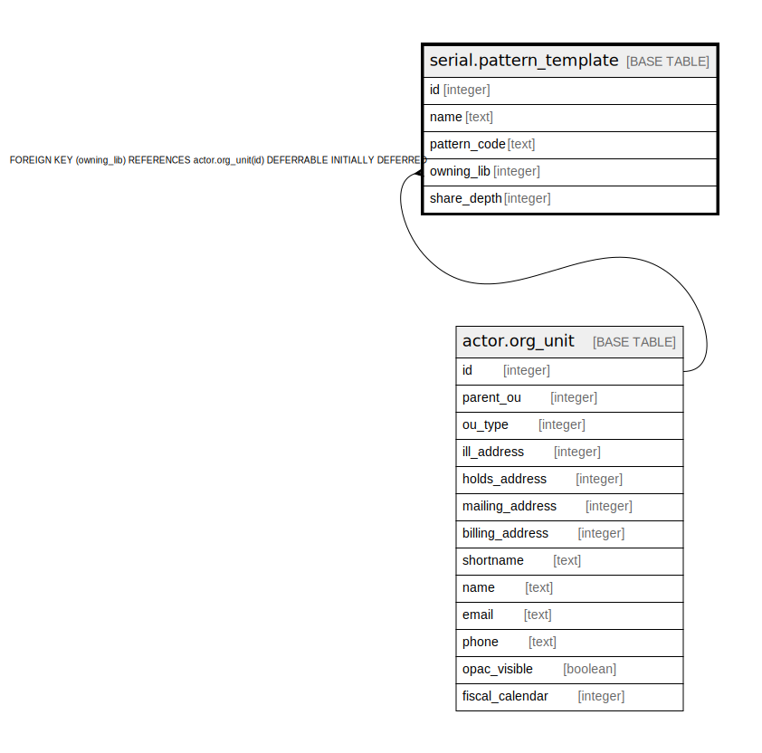

# serial.pattern_template

## Description

## Columns

| Name | Type | Default | Nullable | Children | Parents | Comment |
| ---- | ---- | ------- | -------- | -------- | ------- | ------- |
| id | integer | nextval('serial.pattern_template_id_seq'::regclass) | false |  |  |  |
| name | text |  | false |  |  |  |
| pattern_code | text |  | false |  |  |  |
| owning_lib | integer |  | true |  | [actor.org_unit](actor.org_unit.md) |  |
| share_depth | integer | 0 | false |  |  |  |

## Constraints

| Name | Type | Definition |
| ---- | ---- | ---------- |
| pattern_template_owning_lib_fkey | FOREIGN KEY | FOREIGN KEY (owning_lib) REFERENCES actor.org_unit(id) DEFERRABLE INITIALLY DEFERRED |
| pattern_template_pkey | PRIMARY KEY | PRIMARY KEY (id) |

## Indexes

| Name | Definition |
| ---- | ---------- |
| pattern_template_pkey | CREATE UNIQUE INDEX pattern_template_pkey ON serial.pattern_template USING btree (id) |
| serial_pattern_template_name_idx | CREATE INDEX serial_pattern_template_name_idx ON serial.pattern_template USING btree (lowercase(name)) |

## Relations

---

> Generated by [tbls](https://github.com/k1LoW/tbls)
