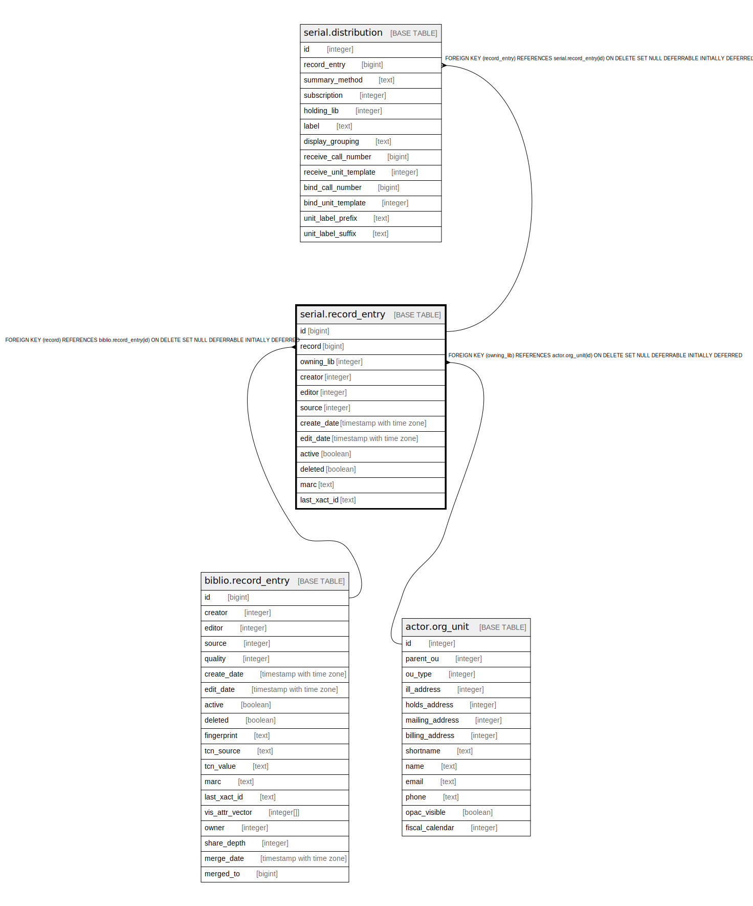

# serial.record_entry

## Description

## Columns

| Name | Type | Default | Nullable | Children | Parents | Comment |
| ---- | ---- | ------- | -------- | -------- | ------- | ------- |
| id | bigint | nextval('serial.record_entry_id_seq'::regclass) | false | [serial.distribution](serial.distribution.md) |  |  |
| record | bigint |  | true |  | [biblio.record_entry](biblio.record_entry.md) |  |
| owning_lib | integer | 1 | false |  | [actor.org_unit](actor.org_unit.md) |  |
| creator | integer | 1 | false |  |  |  |
| editor | integer | 1 | false |  |  |  |
| source | integer |  | true |  |  |  |
| create_date | timestamp with time zone | now() | false |  |  |  |
| edit_date | timestamp with time zone | now() | false |  |  |  |
| active | boolean | true | false |  |  |  |
| deleted | boolean | false | false |  |  |  |
| marc | text |  | true |  |  |  |
| last_xact_id | text |  | false |  |  |  |

## Constraints

| Name | Type | Definition |
| ---- | ---- | ---------- |
| record_entry_owning_lib_fkey | FOREIGN KEY | FOREIGN KEY (owning_lib) REFERENCES actor.org_unit(id) ON DELETE SET NULL DEFERRABLE INITIALLY DEFERRED |
| record_entry_record_fkey | FOREIGN KEY | FOREIGN KEY (record) REFERENCES biblio.record_entry(id) ON DELETE SET NULL DEFERRABLE INITIALLY DEFERRED |
| record_entry_pkey | PRIMARY KEY | PRIMARY KEY (id) |

## Indexes

| Name | Definition |
| ---- | ---------- |
| record_entry_pkey | CREATE UNIQUE INDEX record_entry_pkey ON serial.record_entry USING btree (id) |
| serial_record_entry_creator_idx | CREATE INDEX serial_record_entry_creator_idx ON serial.record_entry USING btree (creator) |
| serial_record_entry_editor_idx | CREATE INDEX serial_record_entry_editor_idx ON serial.record_entry USING btree (editor) |
| serial_record_entry_owning_lib_idx | CREATE INDEX serial_record_entry_owning_lib_idx ON serial.record_entry USING btree (owning_lib, deleted) |
| serial_record_entry_record_idx | CREATE INDEX serial_record_entry_record_idx ON serial.record_entry USING btree (record) |

## Triggers

| Name | Definition |
| ---- | ---------- |
| b_maintain_901 | CREATE TRIGGER b_maintain_901 BEFORE INSERT OR UPDATE ON serial.record_entry FOR EACH ROW EXECUTE PROCEDURE maintain_901() |
| c_maintain_control_numbers | CREATE TRIGGER c_maintain_control_numbers BEFORE INSERT OR UPDATE ON serial.record_entry FOR EACH ROW EXECUTE PROCEDURE maintain_control_numbers() |

## Relations

---

> Generated by [tbls](https://github.com/k1LoW/tbls)
