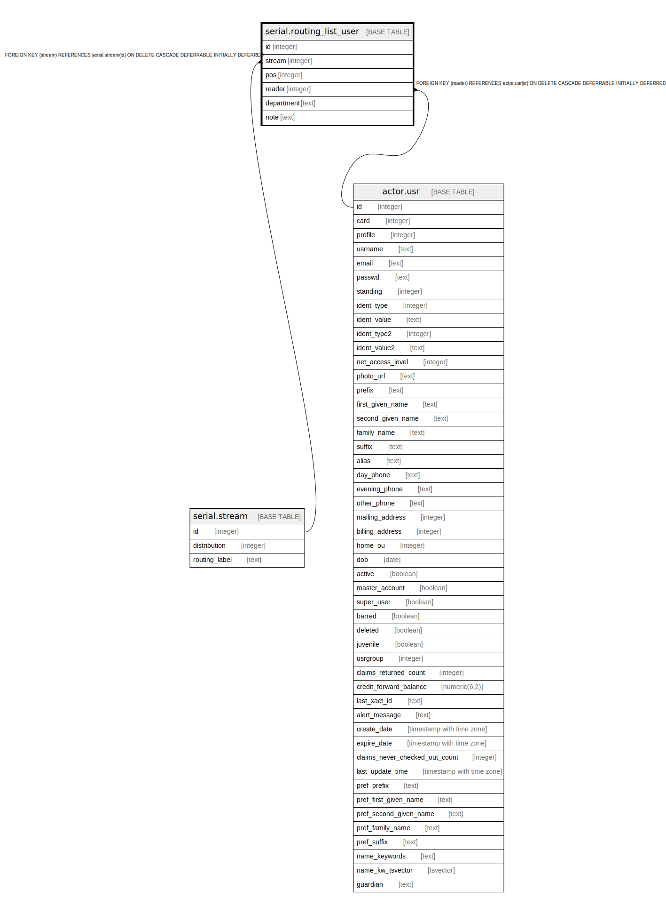

# serial.routing_list_user

## Description

## Columns

| Name | Type | Default | Nullable | Children | Parents | Comment |
| ---- | ---- | ------- | -------- | -------- | ------- | ------- |
| id | integer | nextval('serial.routing_list_user_id_seq'::regclass) | false |  |  |  |
| stream | integer |  | false |  | [serial.stream](serial.stream.md) |  |
| pos | integer | 1 | false |  |  |  |
| reader | integer |  | true |  | [actor.usr](actor.usr.md) |  |
| department | text |  | true |  |  |  |
| note | text |  | true |  |  |  |

## Constraints

| Name | Type | Definition |
| ---- | ---- | ---------- |
| reader_or_dept | CHECK | CHECK ((((reader IS NOT NULL) AND (department IS NULL)) OR ((reader IS NULL) AND (department IS NOT NULL)))) |
| routing_list_user_reader_fkey | FOREIGN KEY | FOREIGN KEY (reader) REFERENCES actor.usr(id) ON DELETE CASCADE DEFERRABLE INITIALLY DEFERRED |
| one_pos_per_routing_list | UNIQUE | UNIQUE (stream, pos) |
| routing_list_user_pkey | PRIMARY KEY | PRIMARY KEY (id) |
| routing_list_user_stream_fkey | FOREIGN KEY | FOREIGN KEY (stream) REFERENCES serial.stream(id) ON DELETE CASCADE DEFERRABLE INITIALLY DEFERRED |

## Indexes

| Name | Definition |
| ---- | ---------- |
| one_pos_per_routing_list | CREATE UNIQUE INDEX one_pos_per_routing_list ON serial.routing_list_user USING btree (stream, pos) |
| routing_list_user_pkey | CREATE UNIQUE INDEX routing_list_user_pkey ON serial.routing_list_user USING btree (id) |
| serial_routing_list_user_reader_idx | CREATE INDEX serial_routing_list_user_reader_idx ON serial.routing_list_user USING btree (reader) |
| serial_routing_list_user_stream_idx | CREATE INDEX serial_routing_list_user_stream_idx ON serial.routing_list_user USING btree (stream) |

## Relations

---

> Generated by [tbls](https://github.com/k1LoW/tbls)
