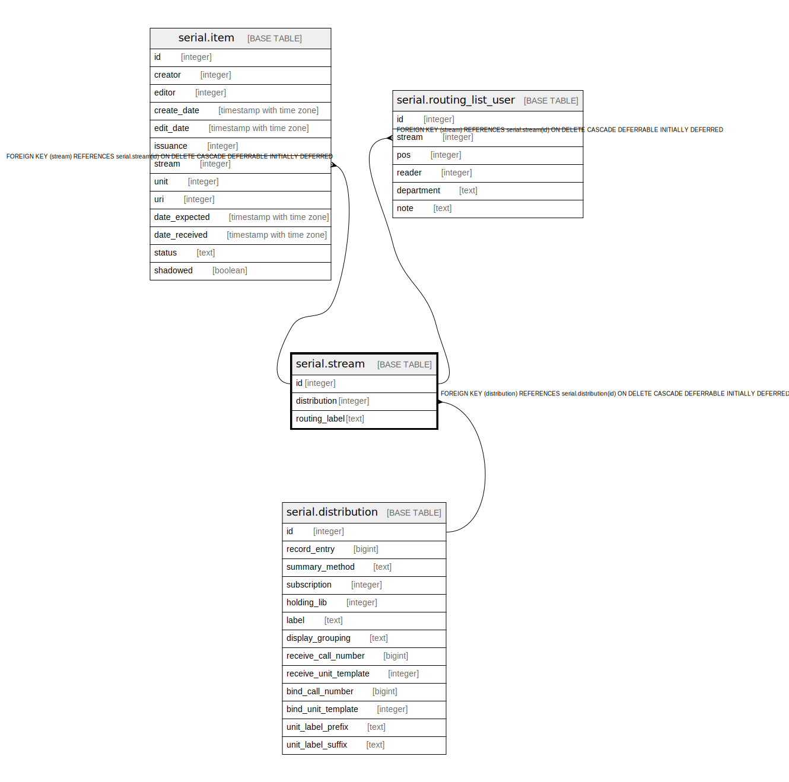

# serial.stream

## Description

## Columns

| Name | Type | Default | Nullable | Children | Parents | Comment |
| ---- | ---- | ------- | -------- | -------- | ------- | ------- |
| id | integer | nextval('serial.stream_id_seq'::regclass) | false | [serial.item](serial.item.md) [serial.routing_list_user](serial.routing_list_user.md) |  |  |
| distribution | integer |  | false |  | [serial.distribution](serial.distribution.md) |  |
| routing_label | text |  | true |  |  |  |

## Constraints

| Name | Type | Definition |
| ---- | ---- | ---------- |
| stream_distribution_fkey | FOREIGN KEY | FOREIGN KEY (distribution) REFERENCES serial.distribution(id) ON DELETE CASCADE DEFERRABLE INITIALLY DEFERRED |
| stream_pkey | PRIMARY KEY | PRIMARY KEY (id) |

## Indexes

| Name | Definition |
| ---- | ---------- |
| stream_pkey | CREATE UNIQUE INDEX stream_pkey ON serial.stream USING btree (id) |
| label_once_per_dist | CREATE UNIQUE INDEX label_once_per_dist ON serial.stream USING btree (distribution, routing_label) WHERE (routing_label IS NOT NULL) |
| serial_stream_dist_idx | CREATE INDEX serial_stream_dist_idx ON serial.stream USING btree (distribution) |

## Relations

---

> Generated by [tbls](https://github.com/k1LoW/tbls)
