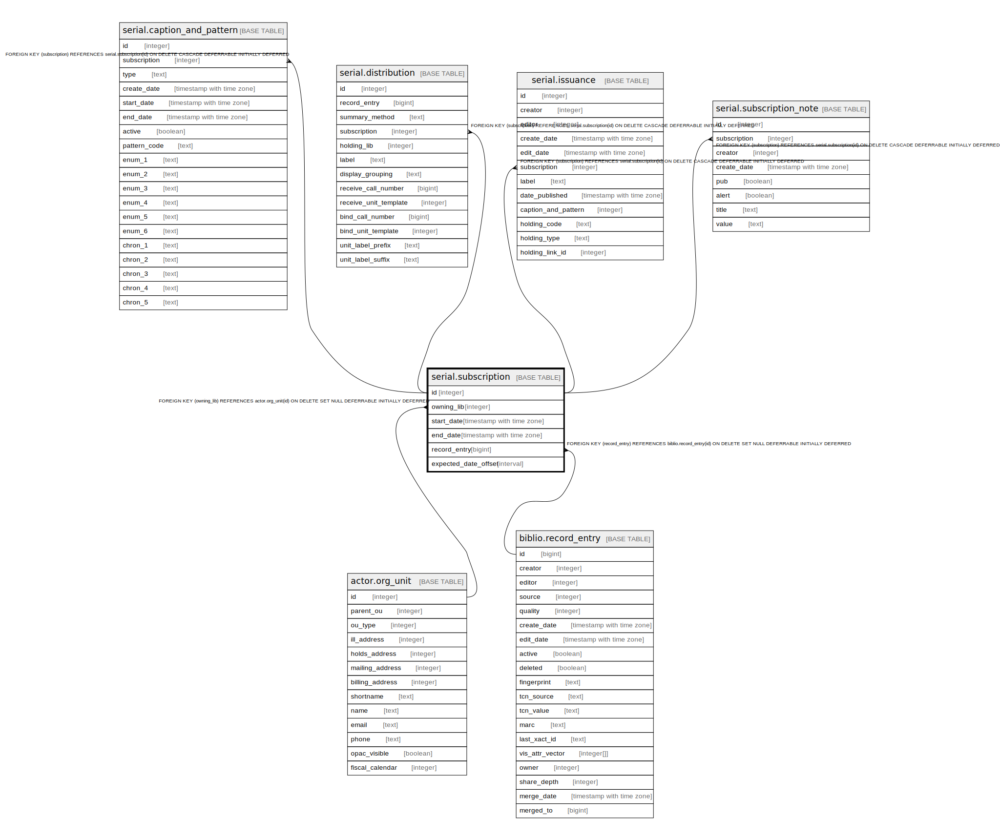

# serial.subscription

## Description

## Columns

| Name | Type | Default | Nullable | Children | Parents | Comment |
| ---- | ---- | ------- | -------- | -------- | ------- | ------- |
| id | integer | nextval('serial.subscription_id_seq'::regclass) | false | [serial.caption_and_pattern](serial.caption_and_pattern.md) [serial.distribution](serial.distribution.md) [serial.issuance](serial.issuance.md) [serial.subscription_note](serial.subscription_note.md) |  |  |
| owning_lib | integer | 1 | false |  | [actor.org_unit](actor.org_unit.md) |  |
| start_date | timestamp with time zone |  | false |  |  |  |
| end_date | timestamp with time zone |  | true |  |  |  |
| record_entry | bigint |  | true |  | [biblio.record_entry](biblio.record_entry.md) |  |
| expected_date_offset | interval |  | true |  |  |  |

## Constraints

| Name | Type | Definition |
| ---- | ---- | ---------- |
| subscription_owning_lib_fkey | FOREIGN KEY | FOREIGN KEY (owning_lib) REFERENCES actor.org_unit(id) ON DELETE SET NULL DEFERRABLE INITIALLY DEFERRED |
| subscription_record_entry_fkey | FOREIGN KEY | FOREIGN KEY (record_entry) REFERENCES biblio.record_entry(id) ON DELETE SET NULL DEFERRABLE INITIALLY DEFERRED |
| subscription_pkey | PRIMARY KEY | PRIMARY KEY (id) |

## Indexes

| Name | Definition |
| ---- | ---------- |
| subscription_pkey | CREATE UNIQUE INDEX subscription_pkey ON serial.subscription USING btree (id) |
| serial_subscription_owner_idx | CREATE INDEX serial_subscription_owner_idx ON serial.subscription USING btree (owning_lib) |
| serial_subscription_record_idx | CREATE INDEX serial_subscription_record_idx ON serial.subscription USING btree (record_entry) |

## Relations

---

> Generated by [tbls](https://github.com/k1LoW/tbls)
