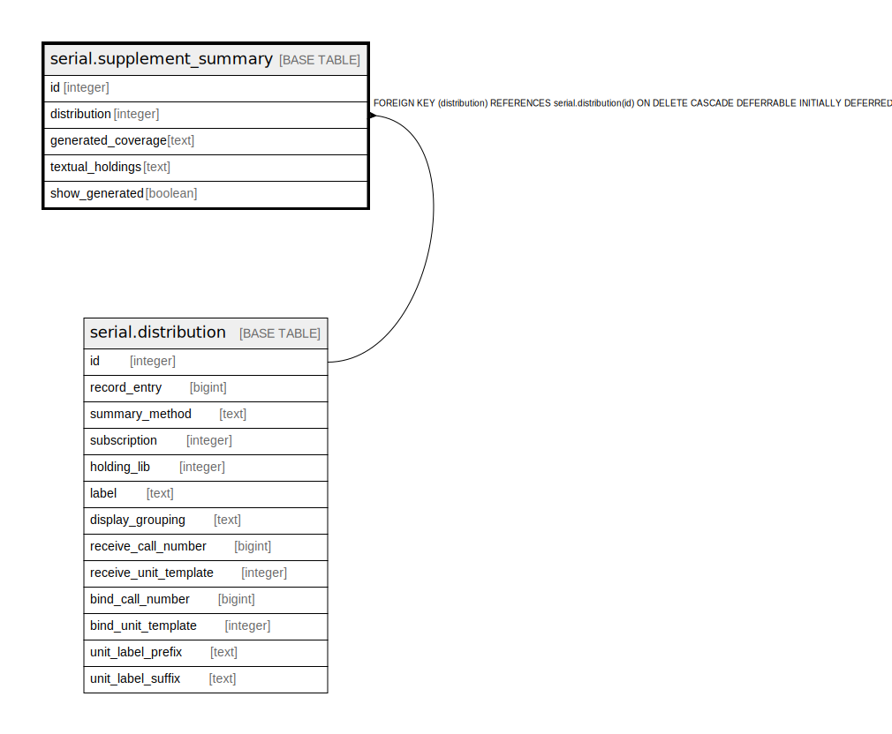

# serial.supplement_summary

## Description

## Columns

| Name | Type | Default | Nullable | Children | Parents | Comment |
| ---- | ---- | ------- | -------- | -------- | ------- | ------- |
| id | integer | nextval('serial.supplement_summary_id_seq'::regclass) | false |  |  |  |
| distribution | integer |  | false |  | [serial.distribution](serial.distribution.md) |  |
| generated_coverage | text |  | false |  |  |  |
| textual_holdings | text |  | true |  |  |  |
| show_generated | boolean | true | false |  |  |  |

## Constraints

| Name | Type | Definition |
| ---- | ---- | ---------- |
| supplement_summary_distribution_fkey | FOREIGN KEY | FOREIGN KEY (distribution) REFERENCES serial.distribution(id) ON DELETE CASCADE DEFERRABLE INITIALLY DEFERRED |
| supplement_summary_pkey | PRIMARY KEY | PRIMARY KEY (id) |

## Indexes

| Name | Definition |
| ---- | ---------- |
| supplement_summary_pkey | CREATE UNIQUE INDEX supplement_summary_pkey ON serial.supplement_summary USING btree (id) |
| serial_supplement_summary_dist_idx | CREATE INDEX serial_supplement_summary_dist_idx ON serial.supplement_summary USING btree (distribution) |

## Relations

---

> Generated by [tbls](https://github.com/k1LoW/tbls)
