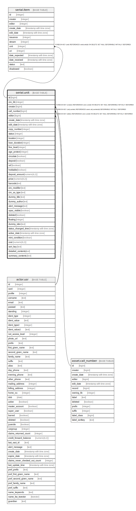

# serial.unit

## Description

## Columns

| Name | Type | Default | Nullable | Children | Parents | Comment |
| ---- | ---- | ------- | -------- | -------- | ------- | ------- |
| id | bigint | nextval('asset.copy_id_seq'::regclass) | false | [serial.item](serial.item.md) |  |  |
| circ_lib | integer |  | false |  |  |  |
| creator | bigint |  | false |  | [actor.usr](actor.usr.md) |  |
| call_number | bigint |  | false |  | [asset.call_number](asset.call_number.md) |  |
| editor | bigint |  | false |  | [actor.usr](actor.usr.md) |  |
| create_date | timestamp with time zone | now() | true |  |  |  |
| edit_date | timestamp with time zone | now() | true |  |  |  |
| copy_number | integer |  | true |  |  |  |
| status | integer | 0 | false |  |  |  |
| location | integer | 1 | false |  |  |  |
| loan_duration | integer |  | false |  |  |  |
| fine_level | integer |  | false |  |  |  |
| age_protect | integer |  | true |  |  |  |
| circulate | boolean | true | false |  |  |  |
| deposit | boolean | false | false |  |  |  |
| ref | boolean | false | false |  |  |  |
| holdable | boolean | true | false |  |  |  |
| deposit_amount | numeric(6,2) | 0.00 | false |  |  |  |
| price | numeric(8,2) |  | true |  |  |  |
| barcode | text |  | false |  |  |  |
| circ_modifier | text |  | true |  |  |  |
| circ_as_type | text |  | true |  |  |  |
| dummy_title | text |  | true |  |  |  |
| dummy_author | text |  | true |  |  |  |
| alert_message | text |  | true |  |  |  |
| opac_visible | boolean | true | false |  |  |  |
| deleted | boolean | false | false |  |  |  |
| floating | integer |  | true |  |  |  |
| dummy_isbn | text |  | true |  |  |  |
| status_changed_time | timestamp with time zone |  | true |  |  |  |
| active_date | timestamp with time zone |  | true |  |  |  |
| mint_condition | boolean | true | false |  |  |  |
| cost | numeric(8,2) |  | true |  |  |  |
| sort_key | text |  | true |  |  |  |
| detailed_contents | text |  | false |  |  |  |
| summary_contents | text |  | false |  |  |  |

## Constraints

| Name | Type | Definition |
| ---- | ---- | ---------- |
| copy_fine_level_check | CHECK | CHECK ((fine_level = ANY (ARRAY[1, 2, 3]))) |
| copy_loan_duration_check | CHECK | CHECK ((loan_duration = ANY (ARRAY[1, 2, 3]))) |
| serial_unit_creator_fkey | FOREIGN KEY | FOREIGN KEY (creator) REFERENCES actor.usr(id) ON DELETE SET NULL DEFERRABLE INITIALLY DEFERRED |
| serial_unit_editor_fkey | FOREIGN KEY | FOREIGN KEY (editor) REFERENCES actor.usr(id) ON DELETE SET NULL DEFERRABLE INITIALLY DEFERRED |
| serial_unit_call_number_fkey | FOREIGN KEY | FOREIGN KEY (call_number) REFERENCES asset.call_number(id) DEFERRABLE INITIALLY DEFERRED |
| unit_pkey | PRIMARY KEY | PRIMARY KEY (id) |

## Indexes

| Name | Definition |
| ---- | ---------- |
| unit_pkey | CREATE UNIQUE INDEX unit_pkey ON serial.unit USING btree (id) |
| unit_avail_cn_idx | CREATE INDEX unit_avail_cn_idx ON serial.unit USING btree (call_number) |
| unit_barcode_key | CREATE UNIQUE INDEX unit_barcode_key ON serial.unit USING btree (barcode) WHERE ((deleted = false) OR (deleted IS FALSE)) |
| unit_cn_idx | CREATE INDEX unit_cn_idx ON serial.unit USING btree (call_number) |
| unit_creator_idx | CREATE INDEX unit_creator_idx ON serial.unit USING btree (creator) |
| unit_editor_idx | CREATE INDEX unit_editor_idx ON serial.unit USING btree (editor) |

## Triggers

| Name | Definition |
| ---- | ---------- |
| audit_serial_unit_update_trigger | CREATE TRIGGER audit_serial_unit_update_trigger AFTER DELETE OR UPDATE ON serial.unit FOR EACH ROW EXECUTE PROCEDURE auditor.audit_serial_unit_func() |
| autogenerate_placeholder_barcode | CREATE TRIGGER autogenerate_placeholder_barcode BEFORE INSERT OR UPDATE ON serial.unit FOR EACH ROW EXECUTE PROCEDURE asset.autogenerate_placeholder_barcode() |
| sunit_created_trig | CREATE TRIGGER sunit_created_trig BEFORE INSERT ON serial.unit FOR EACH ROW EXECUTE PROCEDURE asset.acp_created() |
| sunit_status_changed_trig | CREATE TRIGGER sunit_status_changed_trig BEFORE UPDATE ON serial.unit FOR EACH ROW EXECUTE PROCEDURE asset.acp_status_changed() |
| z_opac_vis_mat_view_del_tgr | CREATE TRIGGER z_opac_vis_mat_view_del_tgr BEFORE DELETE ON serial.unit FOR EACH ROW EXECUTE PROCEDURE asset.cache_copy_visibility() |
| z_opac_vis_mat_view_tgr | CREATE TRIGGER z_opac_vis_mat_view_tgr AFTER INSERT OR UPDATE ON serial.unit FOR EACH ROW EXECUTE PROCEDURE asset.cache_copy_visibility() |

## Relations

---

> Generated by [tbls](https://github.com/k1LoW/tbls)
