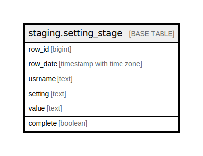

# staging.setting_stage

## Description

## Columns

| Name | Type | Default | Nullable | Children | Parents | Comment |
| ---- | ---- | ------- | -------- | -------- | ------- | ------- |
| row_id | bigint | nextval('staging.setting_stage_row_id_seq'::regclass) | false |  |  |  |
| row_date | timestamp with time zone | now() | true |  |  |  |
| usrname | text |  | false |  |  |  |
| setting | text |  | false |  |  |  |
| value | text |  | false |  |  |  |
| complete | boolean | false | true |  |  |  |

## Constraints

| Name | Type | Definition |
| ---- | ---- | ---------- |
| setting_stage_pkey | PRIMARY KEY | PRIMARY KEY (row_id) |

## Indexes

| Name | Definition |
| ---- | ---------- |
| setting_stage_pkey | CREATE UNIQUE INDEX setting_stage_pkey ON staging.setting_stage USING btree (row_id) |

## Relations

---

> Generated by [tbls](https://github.com/k1LoW/tbls)
